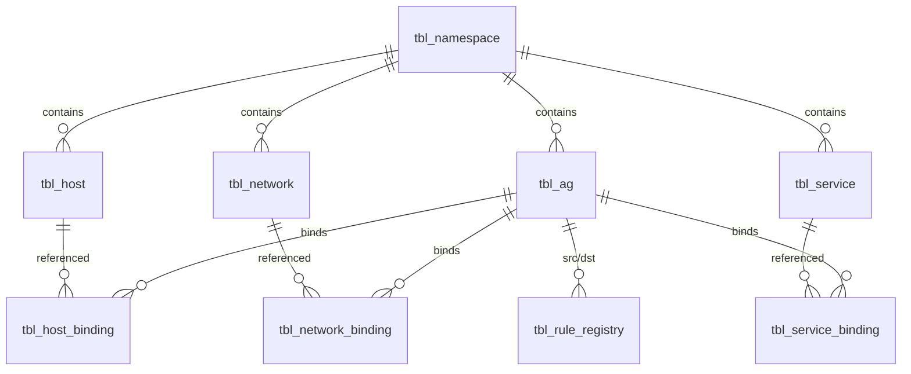

import CodeBlock from '@theme/CodeBlock'
import dedent from 'ts-dedent'

# База данных

sg-server использует **PostgreSQL** в качестве единственного хранилища конфигурации
сетевых политик. Подключение реализовано через драйвер [jackc/pgx/v5](https://github.com/jackc/pgx).

## Требования

- PostgreSQL 14+
- Отдельная база данных и пользователь для sg-server
- Расширения не требуются (стандартный SQL)

### Создание базы данных

<CodeBlock language="sql">
  {dedent`
    CREATE USER sgroups WITH PASSWORD 'secret';
    CREATE DATABASE sgroups OWNER sgroups;
  `}
</CodeBlock>

## Схема данных

Все таблицы создаются в схеме **`sgroups`** и связаны внешними ключами.
Схема отражает доменную модель из 9 типов ресурсов:

| Таблица | Ресурс | Описание |
|---|---|---|
| `tbl_namespace` | Namespace | Пространства имен для изоляции ресурсов |
| `tbl_ag` | AddressGroup | Группы адресов (security groups) |
| `tbl_host` | Host | Управляемые хосты (IP-адреса узлов) |
| `tbl_network` | Network | Сетевые подсети в формате CIDR |
| `tbl_service` | Service | Описания сервисов (порты, протоколы) |
| `tbl_host_binding` | HostBinding | Связь хостов с группами адресов |
| `tbl_network_binding` | NetworkBinding | Связь сетей с группами адресов |
| `tbl_service_binding` | ServiceBinding | Связь сервисов с группами адресов |
| `tbl_rule_registry` | RuleRegistry | Реестр правил межсетевого экрана |

### ER-диаграмма

## Миграции

Управление схемой осуществляется через форк
[Morwran/goose](https://github.com/Morwran/goose) — инструмент версионных SQL-миграций.

### Таблица версий

Goose хранит текущую версию схемы в таблице **`sg_db_ver`** внутри схемы `sgroups`.
Таблица создается автоматически при первом запуске.

### Фрагментированные миграции

Каждая миграция может состоять из нескольких SQL-файлов, объединяемых
скриптом `gen-migration.sh`:

<CodeBlock language="bash">
  {dedent`
    ./scripts/gen-migration.sh
  `}
</CodeBlock>

### Запуск миграций через Docker

<CodeBlock language="bash">
  {dedent`
    # Сборка образа миграций
    docker build -f Dockerfile.goose -t sgroups/goose:latest .

    # Применение миграций
    docker run --rm \
      -e GOOSE_DRIVER=postgres \
      -e GOOSE_DBSTRING="postgres://sgroups:secret@db:5432/sgroups?sslmode=disable" \
      sgroups/goose:latest up
  `}
</CodeBlock>

### Команды Goose

| Команда | Описание |
|---|---|
| `up` | Применить все ожидающие миграции |
| `down` | Откатить последнюю миграцию |
| `status` | Показать статус миграций |
| `version` | Показать текущую версию схемы |

## Docker Compose с миграциями

<CodeBlock language="yaml">
  {dedent`
    services:
      db:
        image: postgres:16-alpine
        environment:
          POSTGRES_DB: sgroups
          POSTGRES_USER: sgroups
          POSTGRES_PASSWORD: secret

      migrations:
        image: sgroups/goose:latest
        environment:
          GOOSE_DRIVER: postgres
          GOOSE_DBSTRING: "postgres://sgroups:secret@db:5432/sgroups?sslmode=disable"
        depends_on:
          - db
        command: ["up"]

      sg-server:
        image: sgroups/sg-server:latest
        environment:
          SG_SERVER_DB_DSN: "postgres://sgroups:secret@db:5432/sgroups?sslmode=disable"
        depends_on:
          migrations:
            condition: service_completed_successfully
  `}
</CodeBlock>

:::caution
Всегда выполняйте миграции **до** запуска sg-server. При несовпадении версии схемы
сервер откажется стартовать и выведет ошибку с ожидаемой и текущей версиями.
:::

:::tip
В CI/CD рекомендуется запускать `goose status` перед применением миграций,
чтобы убедиться в согласованности состояния базы.
:::
