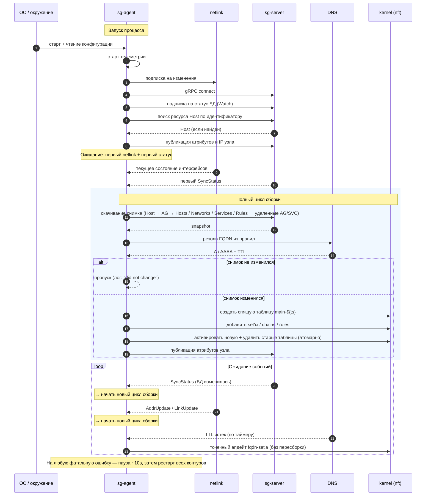

import CodeBlock from '@theme/CodeBlock'
import dedent from 'ts-dedent'

# Жизненный цикл агента

Страница описывает, что делает агент с момента запуска и как он реагирует на
события: изменения в базе сервера, изменения локальной сети, истечение времени
жизни DNS-записей. Описание прикладное: только что и в каком порядке
происходит, без отсылок к конкретным реализациям.

## Запуск агента: что происходит по шагам

1. **Чтение конфигурации.** Агент собирает параметры из трех источников по приоритету:
   аргументы командной строки → переменные окружения с префиксом `NFT_` → файл
   конфигурации. На этом шаге становятся известны: адрес сервера, идентификатор
   локального хоста, DNS-серверы, имя сетевого namespace (если используется),
   стратегия резолва FQDN, политика по умолчанию (`accept` / `drop`), интервалы.

2. **Поднятие телеметрии.** Запускается локальный HTTP-сервер с метриками Prometheus,
   healthcheck-эндпоинтом и pprof-профилировщиком. С этого момента состояние агента
   видимо снаружи.

3. **Подписка на события сетевого стека.** Агент открывает netlink-канал и снимает
   текущее состояние интерфейсов и адресов локального узла. Все будущие изменения
   (поднялся / упал интерфейс, добавился / удалился IP) будут приходить ему
   автоматически.

4. **Подключение к серверу.** Открывается gRPC-канал до `sg-server`. Сразу же
   запускается стрим подписки на статус: сервер сам будет присылать сигналы
   "что-то изменилось в БД".

5. **Поиск себя на сервере.** Агент берет идентификатор локального хоста из
   конфигурации и запрашивает у сервера ресурс `Host` с таким именем.
   - Если хост найден — берутся его атрибуты и список привязанных групп адресов.
   - Если хост **не найден** — это нештатная ситуация для production, но не фатальная.
     Агент пишет предупреждение и продолжает работать; набор правил на узле останется
     минимальным, потому что нет точки входа в граф ресурсов.

6. **Публикация информации о себе.** Агент отправляет на сервер актуальный
   список IPv4/IPv6 локальных интерфейсов, имя ОС, hostname и прочую сводку —
   чтобы серверу было что показать в API статусов. После каждой успешной
   пересборки правил эта информация обновляется заново.

7. **Готовность к работе.** Агент ждет двух сигналов: "сетевое состояние получено"
   и "сервер сообщил версию своих данных". Как только оба собраны — запускается
   первый цикл сборки правил.

## Сборка набора правил: обход графа ресурсов

Имея ресурс `Host`, агент рекурсивно загружает все, что нужно для построения
межсетевого экрана на этом узле. Порядок именно такой:

1. **Локальный `Host` → группы адресов.** В привязках хоста (`HostBinding`) указан
   список локальных AG — это те AG, которые "живут" на этом узле. Все они
   тянутся целиком.

2. **Локальные AG → соседние хосты.** Каждый локальный AG может ссылаться на
   набор `HostBinding`'ов других хостов. Их IP должны попасть в nft-набор этого AG —
   агент запрашивает их данные.

3. **Локальные AG → сети.** Если к AG привязаны `Network`-объекты (через
   `NetworkBinding`), их CIDR попадают в тот же nft-набор.

4. **Локальные AG → сервисы.** Каждый AG может иметь привязки `ServiceBinding` —
   агент загружает соответствующие сервисы целиком (с их транспортами).

5. **Локальные AG и сервисы → правила.** На этом шаге собираются `UniRule`,
   которые ссылаются на любые из найденных AG или сервисов — как на локальную, так и
   на удаленную сторону.

6. **Удаленная сторона правил — догрузка данных.** Если в правиле есть
   `remote.type = ADDRESS_GROUP` или `remote.type = SERVICE`, и эти AG/сервис
   **не локальны** для этого узла, агент догружает их содержимое
   (привязанные хосты, сети, IP); иначе nft-набор удаленной стороны окажется
   пустым и трафик не будет совпадать с правилом.

7. **Разрешение FQDN.** Из правил выбираются все `remote.type = FQDN`, для них
   запрашиваются A/AAAA-записи через DNS из конфигурации. Время жизни записи
   запоминается — агент перезапросит ее ровно к моменту истечения.

8. **Снимок данных.** Все собранные ресурсы складываются в одну
   структуру в памяти — «снимок». Снимок сравнивается с тем, что был
   применен в прошлый раз. Если они одинаковы, пересборка таблицы nft
   пропускается полностью (см. ниже).

9. **Сборка таблицы nft.** Из снимка строится новая таблица семейства `inet` с
   динамическим именем `main-${timestamp}`: наборы, базовые цепочки
   `INGRESS-MAIN` / `EGRESS-MAIN`, per-AG цепочки и правила в них (см.
   [«Структура nftables»](./nft-layout) и [«Соответствие правил nft»](./rule-mapping)).

## Защита от шквала событий

Перед запуском цикла сборки агент дает окну изменений **успокоиться**.
В системе два таких окна — для двух разных источников событий.

### Окно ожидания изменений с сервера

Параметр конфигурации:

```yaml
extapi:
  svc:
    sgroups:
      sync-status:
        interval: 10s   # default
```

Сервер отдает сигналы об изменениях через gRPC-стрим в момент любой записи в БД.
При массовых правках это могут быть десятки уведомлений в секунду. Агент **не
обрабатывает каждое**. Он держит таймер с шагом `interval`: все сигналы, попавшие в
текущее окно, объединяются в один — в конце окна срабатывает ровно одна
обработка.

Поведение по сценариям:

- одиночный сигнал обрабатывается примерно через `interval/2` после события;
- шквал из 100 сигналов за 8 секунд приводит к одной обработке по истечении
  10-секундного окна, без десятков промежуточных пересборок;
- уменьшать `interval` имеет смысл, только если важна минимальная задержка применения
  и допустима повышенная нагрузка от пересборок. Увеличивать — для очень нагруженных
  установок, где правки идут постоянным фоном.

### Окно ожидания изменений в сети узла

Параметр конфигурации:

```yaml
netlink:
  watcher:
    linger: 10s   # default
```

Когда Linux переконфигурирует интерфейсы (например, при поднятии нового пода или
переключении сетевых namespaces), netlink выдает серию сообщений за миллисекунды.
Параметр `linger` — это длительность окна, в течение которого агент копит
netlink-уведомления, прежде чем отдать их в обработку одним пакетом.

Поведение аналогичное: при шквале изменений набор правил перестраивается один раз в
конце окна, а не на каждый отдельный пакет от ядра.

### Полный цикл с учетом окон

1. **Что-то меняется** — у сервера в БД или в сетевом стеке узла.
2. **Окно копит сигналы** в течение `interval` / `linger` секунд.
3. **По истечении окна** агент скачивает полный снимок ресурсов этого узла.
4. **Сравнивает со снимком прошлого цикла.** Сравнение глубокое, поэлементно по
   всем полям.
5. **Если равно** — пишет в лог «состояние не изменилось», набор правил не трогает,
   ждет следующего сигнала.
6. **Если не равно** — собирает новую таблицу nft.

Сравнение снимков работает поверх окон и страхует от лишних пересборок даже при
изменениях, которые попали в окно:

- кто-то поменял правило, не касающееся этого узла, — сигнал прилетит, снимок
  придет, но окажется идентичен предыдущему: пересборки не будет;
- Linux добавил адрес на интерфейсе, не относящемся к локальному `Host`, — событие
  попадет в окно netlink, но содержимое снимка хоста не изменится: пересборки
  не будет.

## Атомарное применение правил

Самый чувствительный момент — **переключение** старого набора правил на новый. Агент
гарантирует, что во время этого процесса трафик не «проваливается»:
старая таблица обслуживает пакеты до тех пор, пока новая не собрана целиком.

Алгоритм переключения по шагам:

1. **Создается новая таблица** с уникальным именем (содержит timestamp), сразу же
   помеченная как «спящая». Ядро ее **не использует** для фильтрации — она
   видна в `nft list ruleset`, но не задействована.
2. **Заполнение спящей таблицы.** В нее постепенно добавляются наборы (адреса AG,
   сервисов, FQDN, локального хоста), базовые цепочки `INGRESS-MAIN` /
   `EGRESS-MAIN`, per-AG цепочки и правила. Каждый шаг — небольшая
   транзакция netlink; при ошибке шаг повторяется с экспоненциальной паузой.
3. **Активация.** Один атомарный шаг снимает с новой таблицы статус «спящая» —
   ядро видит ее как полноценный фильтр.
4. **Удаление старых.** Сразу после активации удаляются все прежние таблицы агента.
   Сторонние конфигурации nftables (созданные другими сервисами) не трогаются:
   у таблиц агента уникальный префикс имени.

Что произойдет, если на каком-то шаге случится сбой:

- сбой **до активации** — спящая таблица остается незавершенной. Агент удаляет
  ее и продолжает работу со старой. Видимый эффект — нулевой, без даунтайма;
- сбой **во время активации или удаления** — ядро выполняет это одной
  операцией netlink. Либо переключение прошло целиком, либо не начиналось.

## Реакция на события

После первой успешной сборки агент работает постоянно и ждет события трех типов.

### Событие 1. Сервер сообщил, что в БД что-то изменилось

Сервер сам присылает агенту сигнал в открытый стрим (без поллинга).
Шквал сигналов объединяется в один по истечении окна
`extapi/svc/sgroups/sync-status/interval` (по умолчанию `10s`) — см.
[«Защита от шквала событий»](#защита-от-шквала-событий).

Что делает агент дальше:

1. Скачивает полный снимок данных для этого узла.
2. Сравнивает со снимком прошлого цикла.
3. Если есть отличия — собирает и применяет новую таблицу nft по алгоритму выше.
4. Если отличий нет — запоминает новую версию сервера и ждет следующего уведомления.

### Событие 2. Изменилось состояние сети узла

Когда Linux добавляет или удаляет IP на любом интерфейсе либо поднимает или опускает
линк, агенту приходит уведомление netlink. Действия:

1. Обновляется внутреннее представление сетевого состояния узла.
2. Запускается пересборка.
3. На шаге сравнения снимков:
   - если изменился **локальный IP, относящийся к ресурсу `Host`** — снимок теперь
     отличается, набор правил перестраивается, новые IP попадают в набор
     локального хоста, а на сервер уходит обновленная информация о хосте;
   - если изменение касалось интерфейса, не относящегося к локальному `Host`
     (например, появилась или исчезла docker-bridge), снимок будет
     эквивалентен прошлому и пересборка пропускается.

### Событие 3. Истекло время жизни DNS-записи

Для каждого FQDN, упомянутого в правилах, агент держит таймер: ровно к моменту
истечения TTL он перезапросит у DNS адреса. Если адреса изменились,
**полная пересборка не запускается**. Вместо нее происходит точечное обновление
одного набора nft: содержимое `NetIPv4-fqdn-<имя>` заменяется на новое
одной транзакцией.

Это самый дешевый класс изменений — не затрагиваются ни цепочки, ни правила,
ни остальные наборы. После обновления планируется следующее разрешение на новый TTL.

Если DNS не отвечает, набор остается прежним. Следующее плановое разрешение
повторит попытку. Если правил с этим FQDN больше нет (например, их удалили
со стороны сервера), соответствующего набора в текущей таблице тоже нет —
обновление молча пропускается.

## Параллельность процессов

Внутри агента одновременно работают четыре независимых контура:

| Контур | Что делает | Источник событий |
|---|---|---|
| Слежение за статусом сервера | держит gRPC-стрим, рассылает «версия сервера обновилась» с дебаунсом | gRPC `SyncStatus.Watch` |
| Слежение за сетью узла | держит netlink, рассылает изменения | netlink |
| Слежение за DNS-записями | по таймерам перезапрашивает FQDN | время |
| Применение правил | принимает события от первых трех и решает, что делать | внутренние очереди |

Все четыре поднимаются в момент запуска и работают до выхода из процесса. Они
обмениваются сообщениями через внутреннюю шину событий: не пишут ничего в
файлы и не вызывают друг друга через сеть.

## Восстановление после сбоев

Каждый из четырех контуров устроен так, что при фатальной ошибке (упал
gRPC-стрим, ядро вернуло ошибку netlink, ни одна попытка применить транзакцию
не удалась) контур завершает работу и сообщает остальным. Тогда:

1. Все четыре контура останавливаются.
2. Агент выдерживает небольшую паузу (по умолчанию 10 секунд).
3. Все четыре контура поднимаются заново — с пустыми очередями, без
   «хвоста» предыдущих событий.
4. Цикл начинается с шага 1: подключение к серверу, поиск своего хоста,
   обход графа, сборка nft.

Этот подход избавляет от ручного восстановления промежуточных
состояний: после рестарта все, что хранится в памяти, создается заново. Текущий набор правил
в ядре в этот момент не трогается: пока новый снимок не пришел и не собран,
старая таблица продолжает обслуживать трафик.

## Полный жизненный цикл одной картинкой



## Краткие гарантии

- Старый набор правил работает до тех пор, пока новый не собран и не активирован, —
  окно без правил исключено.
- Полная пересборка запускается только при реальном изменении данных, относящихся
  к этому узлу. Лишние сигналы фильтруются.
- Изменения IP-адресов FQDN обновляются точечно, без пересборки.
- Любая ошибка приводит к перезапуску внутренних процессов агента, но не таблицы nft:
  ядро видит правила все это время.
- Сторонние таблицы nft, созданные другими сервисами на узле, агент не удаляет.
