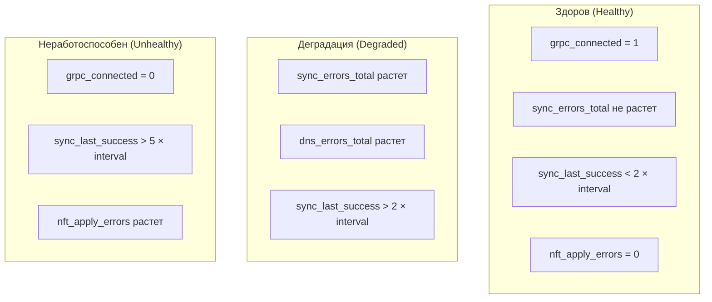

# Мониторинг sg-agent

sg-agent экспортирует метрики в формате Prometheus, позволяя отслеживать состояние
синхронизации, nftables-правил и общую работоспособность агента.

## Настройка эндпоинта метрик

```yaml
metrics:
  enabled: true
  address: ":9650"
```

После запуска метрики доступны по адресу `http://<host>:9650/metrics`.

## Метрики синхронизации

| Метрика | Тип | Описание |
|---|---|---|
| `sg_agent_sync_total` | Counter | Общее количество циклов синхронизации |
| `sg_agent_sync_success_total` | Counter | Успешные синхронизации |
| `sg_agent_sync_errors_total` | Counter | Ошибки синхронизации |
| `sg_agent_sync_duration_seconds` | Histogram | Длительность цикла синхронизации |
| `sg_agent_sync_last_success_timestamp` | Gauge | Время последней успешной синхронизации (Unix timestamp) |

## Метрики nftables

| Метрика | Тип | Описание |
|---|---|---|
| `sg_agent_nft_rules_total` | Gauge | Количество активных правил в nftables |
| `sg_agent_nft_sets_total` | Gauge | Количество наборов (sets) |
| `sg_agent_nft_chains_total` | Gauge | Количество цепочек |
| `sg_agent_nft_apply_duration_seconds` | Histogram | Время применения правил |
| `sg_agent_nft_apply_errors_total` | Counter | Ошибки применения правил |

## Метрики DNS

| Метрика | Тип | Описание |
|---|---|---|
| `sg_agent_dns_queries_total` | Counter | Общее количество DNS-запросов |
| `sg_agent_dns_errors_total` | Counter | Ошибки DNS-резолвинга |
| `sg_agent_dns_cache_hits_total` | Counter | Попадания в DNS-кеш |
| `sg_agent_dns_duration_seconds` | Histogram | Время DNS-запроса |

## Метрики gRPC-соединения

| Метрика | Тип | Описание |
|---|---|---|
| `sg_agent_grpc_connected` | Gauge | Статус подключения к sg-server (1/0) |
| `sg_agent_grpc_reconnects_total` | Counter | Количество переподключений |

## Индикаторы здоровья

Для определения работоспособности агента рекомендуется отслеживать следующие сигналы:



## Пример алертов для Prometheus

```yaml
groups:
  - name: sg-agent
    rules:
      - alert: SGAgentSyncFailing
        expr: |
          time() - sg_agent_sync_last_success_timestamp > 300
        for: 5m
        labels:
          severity: warning
        annotations:
          summary: "sg-agent не синхронизируется более 5 минут"
          description: "Агент на {{ $labels.instance }} не выполнял успешную синхронизацию"

      - alert: SGAgentDisconnected
        expr: sg_agent_grpc_connected == 0
        for: 2m
        labels:
          severity: critical
        annotations:
          summary: "sg-agent потерял связь с sg-server"

      - alert: SGAgentNftApplyErrors
        expr: rate(sg_agent_nft_apply_errors_total[5m]) > 0
        for: 5m
        labels:
          severity: critical
        annotations:
          summary: "Ошибки применения nftables-правил"
```

## Grafana-дашборд

Рекомендуемые панели для мониторинга sg-agent:

| Панель | Запрос | Тип |
|---|---|---|
| Статус подключения | `sg_agent_grpc_connected` | Stat |
| Ошибки синхронизации | `rate(sg_agent_sync_errors_total[5m])` | Time series |
| Длительность синхронизации | `sg_agent_sync_duration_seconds` | Heatmap |
| Количество nft-правил | `sg_agent_nft_rules_total` | Gauge |
| DNS-ошибки | `rate(sg_agent_dns_errors_total[5m])` | Time series |

## Логирование

Уровни логирования настраиваются в конфигурации:

```yaml
logging:
  level: info
  format: json
```

Ключевые события, на которые стоит обратить внимание в логах:

| Уровень | Сообщение | Значение |
|---|---|---|
| `info` | `sync completed` | Успешная синхронизация |
| `warn` | `dns resolve failed` | Не удалось разрешить FQDN |
| `error` | `nft apply failed` | Ошибка применения правил nftables |
| `error` | `server connection lost` | Потеря связи с sg-server |

:::tip
Для production-среды рекомендуется использовать формат `json` — он удобен
для парсинга в системах централизованного логирования (ELK, Loki).
:::
