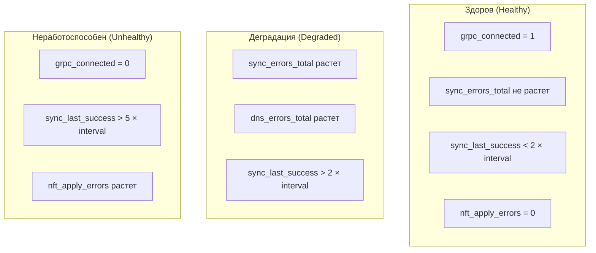

# Мониторинг sg-agent

sg-agent экспортирует метрики в формате Prometheus, позволяя отслеживать состояние
синхронизации, nftables-правил и общую работоспособность агента.

## Настройка эндпоинта метрик

```yaml
metrics:
  enabled: true
  address: ":9650"
```

После запуска метрики доступны по адресу `http://<host>:9650/metrics`.

## Метрики синхронизации

<table>
  <thead>
    <tr>
      <th>Метрика</th>
      <th>Тип</th>
      <th>Описание</th>
    </tr>
  </thead>
  <tbody>
    <tr>
      <td><code>sg_agent_sync_total</code></td>
      <td>Counter</td>
      <td>Общее количество циклов синхронизации</td>
    </tr>
    <tr>
      <td><code>sg_agent_sync_success_total</code></td>
      <td>Counter</td>
      <td>Успешные синхронизации</td>
    </tr>
    <tr>
      <td><code>sg_agent_sync_errors_total</code></td>
      <td>Counter</td>
      <td>Ошибки синхронизации</td>
    </tr>
    <tr>
      <td><code>sg_agent_sync_duration_seconds</code></td>
      <td>Histogram</td>
      <td>Длительность цикла синхронизации</td>
    </tr>
    <tr>
      <td><code>sg_agent_sync_last_success_timestamp</code></td>
      <td>Gauge</td>
      <td>Время последней успешной синхронизации (Unix timestamp)</td>
    </tr>
  </tbody>
</table>

## Метрики nftables

<table>
  <thead>
    <tr>
      <th>Метрика</th>
      <th>Тип</th>
      <th>Описание</th>
    </tr>
  </thead>
  <tbody>
    <tr>
      <td><code>sg_agent_nft_rules_total</code></td>
      <td>Gauge</td>
      <td>Количество активных правил в nftables</td>
    </tr>
    <tr>
      <td><code>sg_agent_nft_sets_total</code></td>
      <td>Gauge</td>
      <td>Количество наборов (sets)</td>
    </tr>
    <tr>
      <td><code>sg_agent_nft_chains_total</code></td>
      <td>Gauge</td>
      <td>Количество цепочек</td>
    </tr>
    <tr>
      <td><code>sg_agent_nft_apply_duration_seconds</code></td>
      <td>Histogram</td>
      <td>Время применения правил</td>
    </tr>
    <tr>
      <td><code>sg_agent_nft_apply_errors_total</code></td>
      <td>Counter</td>
      <td>Ошибки применения правил</td>
    </tr>
  </tbody>
</table>

## Метрики DNS

<table>
  <thead>
    <tr>
      <th>Метрика</th>
      <th>Тип</th>
      <th>Описание</th>
    </tr>
  </thead>
  <tbody>
    <tr>
      <td><code>sg_agent_dns_queries_total</code></td>
      <td>Counter</td>
      <td>Общее количество DNS-запросов</td>
    </tr>
    <tr>
      <td><code>sg_agent_dns_errors_total</code></td>
      <td>Counter</td>
      <td>Ошибки DNS-резолвинга</td>
    </tr>
    <tr>
      <td><code>sg_agent_dns_cache_hits_total</code></td>
      <td>Counter</td>
      <td>Попадания в DNS-кеш</td>
    </tr>
    <tr>
      <td><code>sg_agent_dns_duration_seconds</code></td>
      <td>Histogram</td>
      <td>Время DNS-запроса</td>
    </tr>
  </tbody>
</table>

## Метрики gRPC-соединения

<table>
  <thead>
    <tr>
      <th>Метрика</th>
      <th>Тип</th>
      <th>Описание</th>
    </tr>
  </thead>
  <tbody>
    <tr>
      <td><code>sg_agent_grpc_connected</code></td>
      <td>Gauge</td>
      <td>Статус подключения к sg-server (1/0)</td>
    </tr>
    <tr>
      <td><code>sg_agent_grpc_reconnects_total</code></td>
      <td>Counter</td>
      <td>Количество переподключений</td>
    </tr>
  </tbody>
</table>

## Индикаторы здоровья

Для определения работоспособности агента рекомендуется отслеживать следующие сигналы:



## Пример алертов для Prometheus

```yaml
groups:
  - name: sg-agent
    rules:
      - alert: SGAgentSyncFailing
        expr: |
          time() - sg_agent_sync_last_success_timestamp > 300
        for: 5m
        labels:
          severity: warning
        annotations:
          summary: "sg-agent не синхронизируется более 5 минут"
          description: "Агент на {{ $labels.instance }} не выполнял успешную синхронизацию"

      - alert: SGAgentDisconnected
        expr: sg_agent_grpc_connected == 0
        for: 2m
        labels:
          severity: critical
        annotations:
          summary: "sg-agent потерял связь с sg-server"

      - alert: SGAgentNftApplyErrors
        expr: rate(sg_agent_nft_apply_errors_total[5m]) > 0
        for: 5m
        labels:
          severity: critical
        annotations:
          summary: "Ошибки применения nftables-правил"
```

## Grafana-дашборд

Рекомендуемые панели для мониторинга sg-agent:

<table>
  <thead>
    <tr>
      <th>Панель</th>
      <th>Запрос</th>
      <th>Тип</th>
    </tr>
  </thead>
  <tbody>
    <tr>
      <td>Статус подключения</td>
      <td><code>sg_agent_grpc_connected</code></td>
      <td>Stat</td>
    </tr>
    <tr>
      <td>Ошибки синхронизации</td>
      <td><code>rate(sg_agent_sync_errors_total[5m])</code></td>
      <td>Time series</td>
    </tr>
    <tr>
      <td>Длительность синхронизации</td>
      <td><code>sg_agent_sync_duration_seconds</code></td>
      <td>Heatmap</td>
    </tr>
    <tr>
      <td>Количество nft-правил</td>
      <td><code>sg_agent_nft_rules_total</code></td>
      <td>Gauge</td>
    </tr>
    <tr>
      <td>DNS-ошибки</td>
      <td><code>rate(sg_agent_dns_errors_total[5m])</code></td>
      <td>Time series</td>
    </tr>
  </tbody>
</table>

## Логирование

Уровни логирования настраиваются в конфигурации:

```yaml
logging:
  level: info
  format: json
```

Ключевые события, на которые стоит обратить внимание в логах:

<table>
  <thead>
    <tr>
      <th>Уровень</th>
      <th>Сообщение</th>
      <th>Значение</th>
    </tr>
  </thead>
  <tbody>
    <tr>
      <td><code>info</code></td>
      <td><code>sync completed</code></td>
      <td>Успешная синхронизация</td>
    </tr>
    <tr>
      <td><code>warn</code></td>
      <td><code>dns resolve failed</code></td>
      <td>Не удалось разрешить FQDN</td>
    </tr>
    <tr>
      <td><code>error</code></td>
      <td><code>nft apply failed</code></td>
      <td>Ошибка применения правил nftables</td>
    </tr>
    <tr>
      <td><code>error</code></td>
      <td><code>server connection lost</code></td>
      <td>Потеря связи с sg-server</td>
    </tr>
  </tbody>
</table>

:::tip
Для production-среды рекомендуется использовать формат `json` — он удобен
для парсинга в системах централизованного логирования (ELK, Loki).
:::
