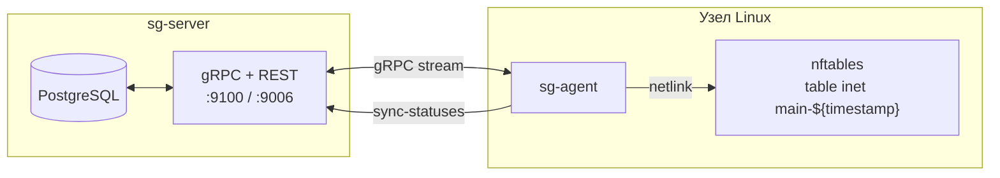

import CodeBlock from '@theme/CodeBlock'
import dedent from 'ts-dedent'

# sg-agent: обзор

`sg-agent` — это локальный сервис на управляемом хосте. Он превращает декларативную модель
SGroups (`AddressGroup`, `Service`, `Host`, `*Binding`, `UniRule`) в работающий набор правил **nftables**.
Сервер `sg-server` сам правила на узле не применяет: он только хранит конфигурацию и отдает ее по gRPC.
Все применение выполняет агент.

## Где работает агент

На каждом узле работает один экземпляр `sg-agent`. Свою таблицу nftables агент создает
с динамическим именем `inet main-${timestamp}` — подробнее в разделе
[«Структура nftables»](./nft-layout).

Полный перечень поддерживаемых типов `UniRule`, ограничения и то, во что они превращаются, —
в разделе [«Соответствие правил nft»](./rule-mapping#поддерживаемые-типы-unirule).

## Что дальше

- [Структура nftables](./nft-layout) — таблица, цепочки, наборы (sets) и пример вывода.
- [Соответствие правил nft](./rule-mapping) — подробная карта `UniRule` → строки nft по каждому типу.
- [Аннотации](./annotations) — `linux-agent.sgroups.io/{trace,logs,priority}` и их nft-модификаторы.
- [Жизненный цикл](./lifecycle) — что делает агент при запуске и в ответ на события.
- [Цикл синхронизации](./sync) — eventual consistency и тонкая настройка.
- [Мониторинг](./monitoring) — метрики Prometheus.
- [Отладка](./troubleshooting) — как читать набор правил и искать типичные расхождения.
