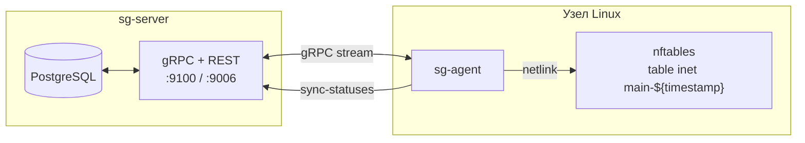

import CodeBlock from '@theme/CodeBlock'
import dedent from 'ts-dedent'

# sg-agent: обзор

`sg-agent` — это локальный сервис на управляемом хосте, который превращает декларативную модель
SGroups (`AddressGroup`, `Service`, `Host`, `*Binding`, `UniRule`) в живой ruleset **nftables**.
Сам сервер `sg-server` правил на узле не пишет — он лишь хранит конфигурацию и отдает ее по gRPC.
Применение правил — задача агента.

## Где живет агент

На каждом узле работает один экземпляр `sg-agent`. Свою nftables-таблицу агент создаёт
с динамическим именем `inet main-${timestamp}` — детально в разделе
[«Структура nftables»](./nft-layout).

Полный перечень поддерживаемых типов `UniRule`, ограничения и куда они материализуются —
в разделе [«Соответствие правил nft»](./rule-mapping#поддерживаемые-типы-unirule).

## Что дальше

- [Структура nftables](./nft-layout) — таблица, цепочки, set'ы и пример вывода
- [Соответствие правил nft](./rule-mapping) — детальная карта `UniRule` → строки nft по каждому типу
- [Аннотации](./annotations) — `linux-agent.sgroups.io/{trace,logs,priority}` и их nft-модификаторы
- [Жизненный цикл](./lifecycle) — что делает агент при запуске и в ответ на события
- [Цикл синхронизации](./sync) — eventual consistency и tuning
- [Мониторинг](./monitoring) — Prometheus-метрики
- [Отладка](./troubleshooting) — как читать ruleset, типичные расхождения
