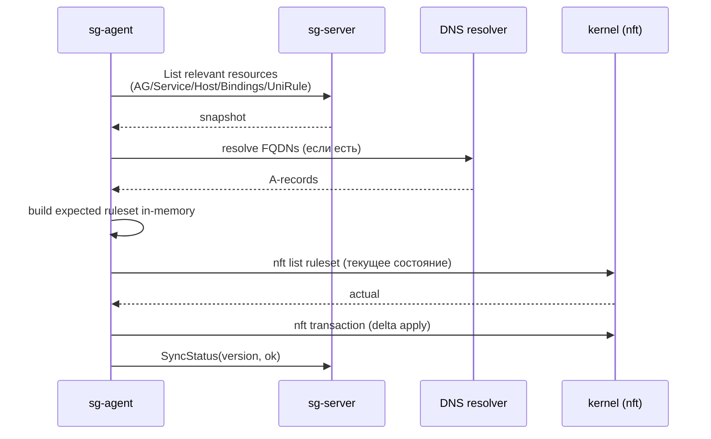

import CodeBlock from '@theme/CodeBlock'
import dedent from 'ts-dedent'

# Цикл синхронизации

Агент работает по **pull-модели**: периодически опрашивает `sg-server`, считает ожидаемый
ruleset и применяет дельту атомарно. Никакого push'а с сервера в агент нет.

## Один цикл



Все правила применяются **в одной nft-транзакции** — либо вся дельта успешна,
либо ruleset остается прежним.

## Eventual consistency

Когда правило приходит на сервер, оно **не сразу** оказывается в `nft` на узле:

1. `POST /v1/rules/upsert` возвращает `accepted` после API-валидации (~секунды).
2. Сервер запускает фоновый reconciler, который раскладывает UniRule на конкретные
   per-узловые ruleset'ы.
3. Каждый агент тянет свою порцию по таймеру `sync.interval` (по умолчанию `30s`).
4. На больших объемах reconciler+агент могут отставать на минуты.

В тестовой инфраструктуре это явление документировано: `sgroups-test-go` после `apply`
1548 правил **обязательно** делает `sleep 600` перед `verify`, иначе видит
700–1500 false-positive `missing`. Цитата из README:

> `apply` возвращает `accepted` через ~2.5 минуты — это означает что приклад **API-уровня
> принял** правила. Реальный nft заполняется **отдельным процессом** в DaemonSet'е,
> который дополняет ruleset порциями. На полной матрице это занимает **5–10 минут**.

:::tip Если verify показывает missing
Подождите ещё 5 минут и запустите снова. Если число `missing` уменьшилось — reconcile ещё
идет. Если стабильно — это реальное расхождение, ищите root cause в `case-error-report.md`.
:::

## Параметры цикла

| Параметр | Default | Зачем менять |
|---|---|---|
| `sync.interval` | `30s` | уменьшить для быстрого реагирования (нагрузка на сервер); увеличить для экономии |
| `sync.initial-backoff` | `1s` | задержка перед первым ретраем после ошибки |
| `sync.max-backoff` | `5m` | потолок экспоненциального бэкоффа |
| `sync.max-retries` | `0` | `0` = без лимита, продолжать вечно |
| `dns.cache-ttl` | `60s` | как долго кешировать FQDN-резолв; уменьшить для динамических доменов |

При ошибке (нет связи с сервером, DNS не отвечает, nft транзакция упала) — следующий цикл
запускается через `initial-backoff`, потом `2× initial-backoff`, и так далее до `max-backoff`.

## Применение setup vs rules

Из тест-харнеса видно, что у агента есть **два класса операций**, которые требуют разной
обработки:

1. **setup** — `Namespace`, `AddressGroup`, `Host`, `HostBinding`, `Network`,
   `NetworkBinding`, `Service`, `ServiceBinding`. Создает топологию: цепочки и пустые set'ы.
2. **rules** — `UniRule`. Добавляет строки внутрь существующих цепочек.

Если применять rules **до того**, как агент успел построить set'ы и цепочки из setup, —
правила могут быть отвергнуты с ошибкой типа `SG0008` или просто не материализоваться.

В `apply`-команде `sgnft` для этого предусмотрен флаг `--post-setup-wait` (default `10s`):

```bash
sgnft apply --resources resources.json --post-setup-wait 30s
```

Эту же паузу разумно выдерживать в production-скриптах массовой загрузки правил.

## Порядок применения внутри цепочки

При обновлении нескольких правил в одной per-AG цепочке агент:

1. Считает все правила, относящиеся к этому AG (с учетом приоритетов).
2. Сортирует по `linux-agent.sgroups.io/priority` ASC.
3. Заменяет содержимое цепочки **целиком** (новой транзакцией), сохраняя сам chain-объект.

То есть отдельная строка не "вставляется" — пересоздается весь массив строк цепочки.
Это упрощает гарантии порядка, но означает, что любое изменение в правиле триггерит
переписывание всей цепочки.

## Ошибки и SyncStatus

После каждого цикла агент шлет `/v1/sync-statuses/upsert` со статусом узла:

| Состояние | Что значит |
|---|---|
| `Synced` | ожидаемое состояние совпадает с реальным; nft транзакция прошла без ошибок |
| `Pending` | reconcile в процессе; реальное состояние отстает |
| `Failed` | nft транзакция упала или DNS-резолв системно не работает |

`sg-server` агрегирует SyncStatus по всем узлам и отдает их через
`/v1/sync-statuses/list` — это удобно для проверки, кто из узлов отстает в данный момент.

См. также [API → Status](/api/status).

## Tuning под большие установки

| Симптом | Что попробовать |
|---|---|
| `sync.interval=30s` создает заметную нагрузку на сервер | увеличить до `60s` или `120s`, использовать watch вместо poll (если включен на сервере) |
| FQDN-правила "мигают" | увеличить `dns.cache-ttl`, добавить второй DNS в `dns.nameservers` |
| Отставание после массового апсёрта правил | уменьшить размер batch'а на стороне клиента, добавить паузу `post-setup-wait` |
| Нагрузка от перестроения цепочек | разбить большие AG на несколько с меньшим количеством правил |
