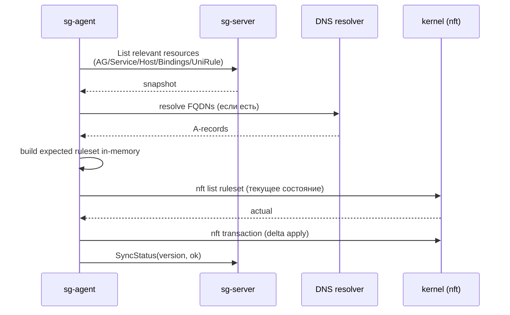

import CodeBlock from '@theme/CodeBlock'
import dedent from 'ts-dedent'

# Цикл синхронизации

Агент работает по **pull-модели**: периодически опрашивает `sg-server`, рассчитывает ожидаемый
набор правил и применяет дельту атомарно. Push с сервера в агент не используется.

## Один цикл



Все правила применяются **в одной транзакции nft**: либо вся дельта успешна,
либо набор правил остается прежним.

## Eventual consistency

Когда правило приходит на сервер, оно **не сразу** оказывается в `nft` на узле:

1. `POST /v1/rules/upsert` возвращает `accepted` после валидации API (несколько секунд).
2. Сервер запускает фоновый reconciler, который раскладывает `UniRule` на конкретные
   наборы правил для каждого узла.
3. Каждый агент забирает свою часть по таймеру `sync.interval` (по умолчанию `30s`).
4. На больших объемах reconciler и агент могут отставать на минуты.

В тестовой инфраструктуре это явление задокументировано: `sgroups-test-go` после `apply`
1548 правил **обязательно** делает `sleep 600` перед `verify`, иначе получает
700–1500 ложноположительных `missing`. Цитата из README:

> `apply` возвращает `accepted` примерно за 2,5 минуты — это означает, что **API-уровень
> принял** правила. Сама таблица nft заполняется **отдельным процессом** в DaemonSet,
> который дополняет набор правил порциями. На полной матрице это занимает **5–10 минут**.

:::tip Если verify сообщает о missing
Подождите еще 5 минут и запустите проверку снова. Если число `missing` уменьшилось — reconcile еще
идет. Если показатель стабилен, это реальное расхождение: ищите причину в `case-error-report.md`.
:::

## Параметры цикла

| Параметр | По умолчанию | Зачем менять |
|---|---|---|
| `sync.interval` | `30s` | уменьшить для быстрого реагирования (повышает нагрузку на сервер); увеличить для экономии ресурсов |
| `sync.initial-backoff` | `1s` | задержка перед первой повторной попыткой после ошибки |
| `sync.max-backoff` | `5m` | потолок экспоненциальной задержки |
| `sync.max-retries` | `0` | `0` — без ограничения, повторять до успеха |
| `dns.cache-ttl` | `60s` | как долго кэшировать результат разрешения FQDN; уменьшить для динамических доменов |

При ошибке (нет связи с сервером, DNS не отвечает, транзакция nft не прошла) следующий цикл
запускается через `initial-backoff`, затем `2 × initial-backoff` и так далее до `max-backoff`.

## Применение setup и rules

У агента есть **два класса операций**, которые требуют разной обработки:

1. **setup** — `Namespace`, `AddressGroup`, `Host`, `HostBinding`, `Network`,
   `NetworkBinding`, `Service`, `ServiceBinding`. Создает топологию: цепочки и пустые наборы.
2. **rules** — `UniRule`. Добавляет строки внутрь существующих цепочек.

Если применять `rules` **до того**, как агент успел построить наборы и цепочки из `setup`,
правила могут быть отвергнуты с ошибкой типа `SG0008` или просто не появиться в nft.

В команде `apply` утилиты `sgnft` для этого предусмотрен флаг `--post-setup-wait` (по умолчанию `10s`):

```bash
sgnft apply --resources resources.json --post-setup-wait 30s
```

Эту же паузу разумно выдерживать в production-скриптах массовой загрузки правил.

## Порядок применения внутри цепочки

При обновлении нескольких правил в одной per-AG цепочке агент:

1. Считывает все правила, относящиеся к этому AG (с учетом приоритетов).
2. Сортирует их по `linux-agent.sgroups.io/priority` по возрастанию.
3. Заменяет содержимое цепочки **целиком** (новой транзакцией), сохраняя сам объект-цепочку.

Отдельная строка не «вставляется» — пересоздается весь массив строк цепочки.
Это упрощает гарантии порядка, но означает, что любое изменение в правиле приводит к
переписыванию всей цепочки.

## Ошибки и SyncStatus

После каждого цикла агент отправляет `/v1/sync-statuses/upsert` со статусом узла:

| Состояние | Что значит |
|---|---|
| `Synced` | ожидаемое состояние совпадает с реальным, транзакция nft прошла без ошибок |
| `Pending` | reconcile в процессе, реальное состояние отстает |
| `Failed` | транзакция nft не прошла или DNS системно не работает |

`sg-server` агрегирует `SyncStatus` по всем узлам и отдает его через
`/v1/sync-statuses/list` — это удобно, чтобы понять, кто из узлов отстает в данный момент.

См. также [API → Status](/api/status).

## Tuning под большие установки

| Симптом | Что попробовать |
|---|---|
| `sync.interval=30s` создает заметную нагрузку на сервер | увеличить до `60s` или `120s`; использовать watch вместо опроса (если включен на сервере) |
| FQDN-правила «мигают» | увеличить `dns.cache-ttl`, добавить второй DNS в `dns.nameservers` |
| Отставание после массового апсерта правил | уменьшить размер пачки на стороне клиента, добавить паузу `post-setup-wait` |
| Нагрузка из-за перестроения цепочек | разбить большие AG на несколько с меньшим количеством правил |
