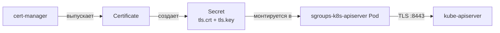

import CodeBlock from '@theme/CodeBlock'
import dedent from 'ts-dedent'

# Конфигурация sgroups-k8s-api

API-сервер читает один YAML-файл, путь к которому передается флагом `--config`.
В Kubernetes-манифестах конфигурация хранится в `ConfigMap` и монтируется в pod как файл.

## Полный пример YAML

<CodeBlock language="yaml">
  {dedent`
    serving:
      securePort: 8443
      tlsCertFile: /etc/sgroups/tls/tls.crt
      tlsPrivateKeyFile: /etc/sgroups/tls/tls.key

    grpc:
      address: "sgroups-backend.sgroups-system.svc:8081"
      insecure: true
      timeout: 30s
      ca: ""
      cert: ""
      key: ""
      serverName: ""
      maxRecvMsgSize: 16777216
      keepaliveTime: 30s
      keepaliveTimeout: 10s
      permitWithoutStream: true
      minConnectTimeout: 10s
      backoffMaxDelay: 120s
  `}
</CodeBlock>

## Параметры: serving

HTTPS-эндпоинт, на котором API-сервер обслуживает запросы от `kube-apiserver`.

<table>
  <thead>
    <tr>
      <th>Ключ YAML</th>
      <th>Default</th>
      <th>Описание</th>
    </tr>
  </thead>
  <tbody>
    <tr>
      <td><code>serving/securePort</code></td>
      <td><code>8443</code></td>
      <td>TLS-порт</td>
    </tr>
    <tr>
      <td><code>serving/tlsCertFile</code></td>
      <td>—</td>
      <td>Путь к серверному сертификату (PEM)</td>
    </tr>
    <tr>
      <td><code>serving/tlsPrivateKeyFile</code></td>
      <td>—</td>
      <td>Путь к приватному ключу (PEM)</td>
    </tr>
  </tbody>
</table>

Сертификаты выпускает `cert-manager` через `Certificate` → `Secret`. Сам Secret
монтируется в pod по пути `/etc/sgroups/tls/`.

## Параметры: grpc (подключение к sg-server)

API-сервер проксирует операции в `sg-server` (или в `sgroups-mock-backend` в
режиме разработки) через gRPC.

<table>
  <thead>
    <tr>
      <th>Ключ YAML</th>
      <th>Default</th>
      <th>Описание</th>
    </tr>
  </thead>
  <tbody>
    <tr>
      <td><code>grpc/address</code></td>
      <td>—</td>
      <td>Адрес `sg-server` в формате <code>host:port</code></td>
    </tr>
    <tr>
      <td><code>grpc/insecure</code></td>
      <td><code>false</code></td>
      <td>Отключить TLS до бэкенда (для in-cluster mock-бэкенда выставляйте <code>true</code>)</td>
    </tr>
    <tr>
      <td><code>grpc/timeout</code></td>
      <td><code>30s</code></td>
      <td>Таймаут одного gRPC-вызова</td>
    </tr>
    <tr>
      <td><code>grpc/ca</code></td>
      <td>—</td>
      <td>CA для проверки сертификата сервера (если <code>insecure: false</code>)</td>
    </tr>
    <tr>
      <td><code>grpc/cert</code> / <code>grpc/key</code></td>
      <td>—</td>
      <td>Клиентский сертификат и ключ (для mTLS)</td>
    </tr>
    <tr>
      <td><code>grpc/serverName</code></td>
      <td>—</td>
      <td>Переопределить серверное имя для проверки SAN</td>
    </tr>
    <tr>
      <td><code>grpc/maxRecvMsgSize</code></td>
      <td><code>16777216</code></td>
      <td>Лимит размера ответа (16 MiB)</td>
    </tr>
    <tr>
      <td><code>grpc/keepaliveTime</code></td>
      <td><code>30s</code></td>
      <td>Интервал keepalive-пингов</td>
    </tr>
    <tr>
      <td><code>grpc/keepaliveTimeout</code></td>
      <td><code>10s</code></td>
      <td>Таймаут ответа на пинг</td>
    </tr>
    <tr>
      <td><code>grpc/permitWithoutStream</code></td>
      <td><code>true</code></td>
      <td>Разрешить keepalive без открытого стрима</td>
    </tr>
    <tr>
      <td><code>grpc/minConnectTimeout</code></td>
      <td><code>10s</code></td>
      <td>Минимальный таймаут на установку соединения</td>
    </tr>
    <tr>
      <td><code>grpc/backoffMaxDelay</code></td>
      <td><code>120s</code></td>
      <td>Потолок экспоненциальной задержки при переподключении</td>
    </tr>
  </tbody>
</table>

## Подключение к real `sg-server` (mTLS)

<CodeBlock language="yaml">
  {dedent`
    grpc:
      address: "sg-server.sgroups-system.svc:9006"
      insecure: false
      ca: /etc/sgroups/grpc-tls/ca.crt
      cert: /etc/sgroups/grpc-tls/client.crt
      key: /etc/sgroups/grpc-tls/client.key
      serverName: sg-server
  `}
</CodeBlock>

CA и клиентский сертификат добавляются как отдельные `Secret` и монтируются
в Deployment API-сервера.

## Подключение к mock-бэкенду (для разработки)

`sgroups-mock-backend` хранит данные в памяти и не требует TLS:

<CodeBlock language="yaml">
  {dedent`
    grpc:
      address: "sgroups-backend.sgroups-system.svc:8081"
      insecure: true
  `}
</CodeBlock>

Это значение по умолчанию в `config/apiserver-config.yaml` репозитория.

:::warning
Mock-бэкенд предназначен **только** для разработки и smoke-тестов. Данные
теряются при перезапуске пода, нагрузку production он не выдержит.
:::

## ConfigMap и монтирование

В Kustomize конфиг прописывается через `configMapGenerator`:

<CodeBlock language="yaml">
  {dedent`
    # config/kustomization.yaml
    configMapGenerator:
      - name: sgroups-apiserver-config
        namespace: sgroups-system
        files:
          - config.yaml=apiserver-config.yaml
    generatorOptions:
      disableNameSuffixHash: true
  `}
</CodeBlock>

В Deployment этот ConfigMap монтируется в `/etc/sgroups/config/`, а флаг
запуска — `--config=/etc/sgroups/config/config.yaml`.

## RBAC

Для регистрации Aggregated API Server нужны два набора прав.

### Делегирование аутентификации

`kube-apiserver` проверяет токены и сертификаты вызывающих и передает уже
аутентифицированный запрос в Aggregated API. Для этого ServiceAccount сервера должен иметь
роль `system:auth-delegator`:

<CodeBlock language="yaml">
  {dedent`
    apiVersion: rbac.authorization.k8s.io/v1
    kind: ClusterRoleBinding
    metadata:
      name: sgroups-k8s-apiserver:system:auth-delegator
    roleRef:
      apiGroup: rbac.authorization.k8s.io
      kind: ClusterRole
      name: system:auth-delegator
    subjects:
      - kind: ServiceAccount
        name: sgroups-k8s-apiserver
        namespace: sgroups-system
  `}
</CodeBlock>

### Роли для пользователей API

<CodeBlock language="yaml">
  {dedent`
    apiVersion: rbac.authorization.k8s.io/v1
    kind: ClusterRole
    metadata:
      name: sgroups-admin
    rules:
      - apiGroups: ["sgroups.io"]
        resources: ["*"]
        verbs: ["get", "list", "watch", "create", "update", "patch", "delete"]
    ---
    apiVersion: rbac.authorization.k8s.io/v1
    kind: ClusterRole
    metadata:
      name: sgroups-viewer
    rules:
      - apiGroups: ["sgroups.io"]
        resources: ["*"]
        verbs: ["get", "list", "watch"]
  `}
</CodeBlock>

:::tip
В production вместо wildcard `"*"` лучше использовать гранулярные роли по конкретным
ресурсам — например, отдельную роль на `rules` без доступа к `tenants`.
:::

## TLS через cert-manager

Сертификаты для `serving/*` управляются `cert-manager`:

<CodeBlock language="yaml">
  {dedent`
    apiVersion: cert-manager.io/v1
    kind: Certificate
    metadata:
      name: sgroups-apiserver-tls
      namespace: sgroups-system
    spec:
      secretName: sgroups-apiserver-tls
      issuerRef:
        name: sgroups-selfsigned
        kind: Issuer
      dnsNames:
        - sgroups-k8s-apiserver.sgroups-system.svc
        - sgroups-k8s-apiserver.sgroups-system.svc.cluster.local
      duration: 8760h
      renewBefore: 720h
  `}
</CodeBlock>

Полные манифесты `cert-manager` находятся в `config/certificates.yaml`.
