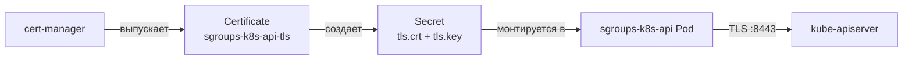

import CodeBlock from '@theme/CodeBlock'
import dedent from 'ts-dedent'

# Kubernetes — Aggregated API Server

`sgroups-k8s-api` — Kubernetes Aggregated API Server, предоставляющий ресурсы SGroups
как нативные объекты Kubernetes. Позволяет управлять сетевыми политиками через `kubectl`
и стандартные Kubernetes-клиенты.

## Предварительные требования

| Требование | Минимальная версия | Назначение |
|---|---|---|
| Kubernetes-кластер | 1.30+ | Целевая платформа |
| cert-manager | 1.14+ | Выпуск TLS-сертификатов для API-сервера |
| kubectl | 1.30+ | Управление ресурсами |
| Go | 1.25 | Сборка из исходников |
| Docker | 24+ | Сборка образов |
| kind | 0.23+ | Локальный кластер (опционально) |

## Быстрый старт с kind

<CodeBlock language="bash">
  {dedent`
    git clone https://github.com/PRO-Robotech/sgroups-k8s-api.git
    cd sgroups-k8s-api

    # Создание kind-кластера, сборка, деплой и smoke-тесты
    make setup
    make deploy
    make smoke-test
  `}
</CodeBlock>

Команда `make setup` выполняет:
1. Создание kind-кластера с необходимой конфигурацией
2. Установку cert-manager в кластер
3. Ожидание готовности cert-manager webhooks

:::info
При использовании `make setup` по умолчанию разворачивается mock-бэкенд
вместо реального `sg-server`. Это позволяет работать с API без дополнительной инфраструктуры.
:::

## Сборка Docker-образов

<CodeBlock language="bash">
  {dedent`
    # API-сервер (distroless)
    make docker-build IMG=sgroups-k8s-api:latest

    # Mock-бэкенд для разработки
    make docker-build-mock IMG=sgroups-mock:latest
  `}
</CodeBlock>

## Деплой через Kustomize

### Структура манифестов

<CodeBlock>
  {dedent`
    deploy/
    ├── kustomization.yaml          # Корневой оверлей
    ├── namespace.yaml              # Namespace sgroups-system
    ├── apiservice.yaml             # Регистрация APIService в kube-apiserver
    ├── deployment.yaml             # Deployment сервера
    ├── service.yaml                # ClusterIP Service
    ├── rbac/
    │   ├── clusterrole.yaml        # Роли для доступа к API
    │   ├── clusterrolebinding.yaml # Привязки ролей
    │   └── auth-delegator.yaml     # Делегирование аутентификации
    ├── certs/
    │   ├── certificate.yaml        # cert-manager Certificate
    │   └── issuer.yaml             # cert-manager Issuer
    └── config/
        └── apiserver-config.yaml   # Конфигурация сервера
  `}
</CodeBlock>

### Установка в production-кластер

<CodeBlock language="bash">
  {dedent`
    # Убедитесь, что cert-manager установлен
    kubectl get pods -n cert-manager

    # Деплой через Makefile
    make deploy

    # Или напрямую через kustomize
    kubectl apply -k deploy/
  `}
</CodeBlock>

### Проверка установки

<CodeBlock language="bash">
  {dedent`
    # Статус APIService
    kubectl get apiservice v1alpha1.sgroups.io

    # Статус подов
    kubectl get pods -n sgroups-system

    # Проверка доступности API
    kubectl api-resources --api-group=sgroups.io
  `}
</CodeBlock>

:::warning
Убедитесь, что cert-manager полностью готов перед деплоем `sgroups-k8s-api`.
Сертификаты должны быть выпущены до старта API-сервера, иначе `kube-apiserver`
не сможет установить TLS-соединение.
:::

## Конфигурация: apiserver-config.yaml

<CodeBlock language="yaml">
  {dedent`
    apiVersion: sgroups.io/v1alpha1
    kind: APIServerConfig
    server:
      tls:
        certFile: /certs/tls.crt
        keyFile: /certs/tls.key
        port: 8443

      backend:
        address: sg-server.sgroups-system.svc:9000
        tls:
          enabled: true
          caFile: /certs/ca.crt
          certFile: /certs/client.crt
          keyFile: /certs/client.key

      timeouts:
        read: 30s
        write: 30s
        idle: 120s

      keepalive:
        time: 30s
        timeout: 10s
        permitWithoutStream: true
  `}
</CodeBlock>

### Параметры подключения к бэкенду

| Параметр | Тип | Описание |
|---|---|---|
| `backend.address` | string | Адрес `sg-server` в формате `host:port` |
| `backend.tls.enabled` | bool | Включение mTLS для gRPC-соединения |
| `backend.tls.caFile` | string | Путь к CA-сертификату |
| `backend.tls.certFile` | string | Путь к клиентскому сертификату |
| `backend.tls.keyFile` | string | Путь к клиентскому ключу |
| `timeouts.read` | duration | Таймаут чтения gRPC-ответа |
| `timeouts.write` | duration | Таймаут отправки gRPC-запроса |
| `keepalive.time` | duration | Интервал keepalive-пингов |

## TLS и cert-manager

API-сервер требует TLS-сертификат для обслуживания HTTPS-запросов от `kube-apiserver`.
При деплое через Kustomize сертификаты управляются автоматически:

<CodeBlock language="yaml">
  {dedent`
    apiVersion: cert-manager.io/v1
    kind: Certificate
    metadata:
      name: sgroups-k8s-api-tls
      namespace: sgroups-system
    spec:
      secretName: sgroups-k8s-api-tls
      issuerRef:
        name: sgroups-selfsigned
        kind: Issuer
      dnsNames:
        - sgroups-k8s-api.sgroups-system.svc
        - sgroups-k8s-api.sgroups-system.svc.cluster.local
      duration: 8760h
      renewBefore: 720h
  `}
</CodeBlock>

## RBAC

### Делегирование аутентификации

<CodeBlock language="yaml">
  {dedent`
    apiVersion: rbac.authorization.k8s.io/v1
    kind: ClusterRoleBinding
    metadata:
      name: sgroups-k8s-api:system:auth-delegator
    roleRef:
      apiGroup: rbac.authorization.k8s.io
      kind: ClusterRole
      name: system:auth-delegator
    subjects:
      - kind: ServiceAccount
        name: sgroups-k8s-api
        namespace: sgroups-system
  `}
</CodeBlock>

### Роли для пользователей API

<CodeBlock language="yaml">
  {dedent`
    apiVersion: rbac.authorization.k8s.io/v1
    kind: ClusterRole
    metadata:
      name: sgroups-admin
    rules:
      - apiGroups: ["sgroups.io"]
        resources: ["*"]
        verbs: ["get", "list", "watch", "create", "update", "patch", "delete"]
    ---
    apiVersion: rbac.authorization.k8s.io/v1
    kind: ClusterRole
    metadata:
      name: sgroups-viewer
    rules:
      - apiGroups: ["sgroups.io"]
        resources: ["*"]
        verbs: ["get", "list", "watch"]
  `}
</CodeBlock>

:::tip
Для production рекомендуется создавать гранулярные роли с ограничением
по конкретным типам ресурсов вместо wildcard `"*"`.
:::

## Mock-бэкенд для разработки

Для локальной разработки без реального `sg-server` можно использовать
встроенный mock-бэкенд (данные в памяти, полный gRPC API):

<CodeBlock language="bash">
  {dedent`
    make docker-build-mock IMG=sgroups-mock:latest
    make setup
  `}
</CodeBlock>

Конфигурация для mock-режима:

<CodeBlock language="yaml">
  {dedent`
    server:
      backend:
        address: sgroups-mock.sgroups-system.svc:9000
        tls:
          enabled: false
  `}
</CodeBlock>

:::warning
Mock-бэкенд предназначен исключительно для разработки и тестирования.
Данные хранятся в памяти и теряются при перезапуске пода.
:::

## Makefile-цели

| Команда | Описание |
|---|---|
| `make build` | Сборка бинарного файла |
| `make lint` | Запуск линтеров |
| `make test` | Юнит-тесты |
| `make verify` | Проверка сгенерированного кода |
| `make openapi-spec` | Генерация OpenAPI-спецификации |
| `make generate` | Кодогенерация (deepcopy, client, informer) |
| `make docker-build` | Сборка Docker-образа API-сервера |
| `make docker-build-mock` | Сборка Docker-образа mock-бэкенда |
| `make setup` | Создание kind-кластера с зависимостями |
| `make deploy` | Деплой в текущий кластер |
| `make smoke-test` | Smoke-тесты через Postman/Newman |
| `make teardown` | Удаление kind-кластера |

## Удаление

<CodeBlock language="bash">
  {dedent`
    # Удаление из кластера
    kubectl delete -k deploy/

    # Полное удаление kind-кластера
    make teardown
  `}
</CodeBlock>
