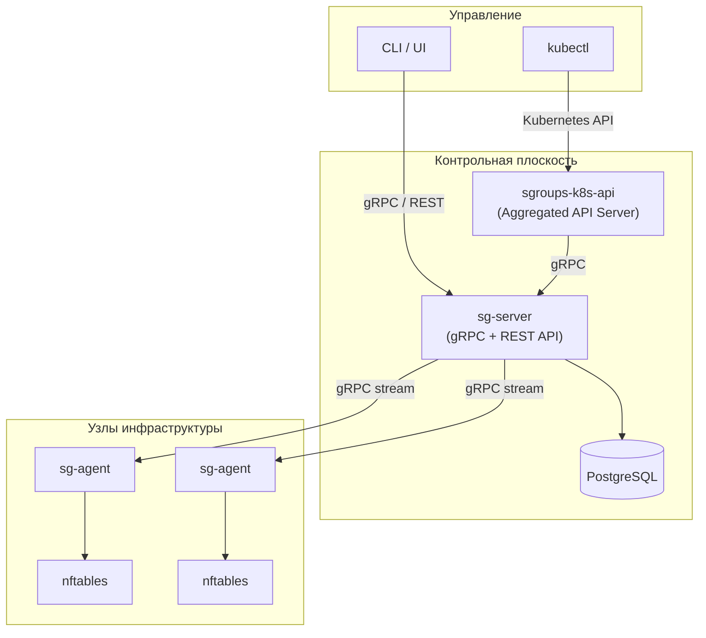
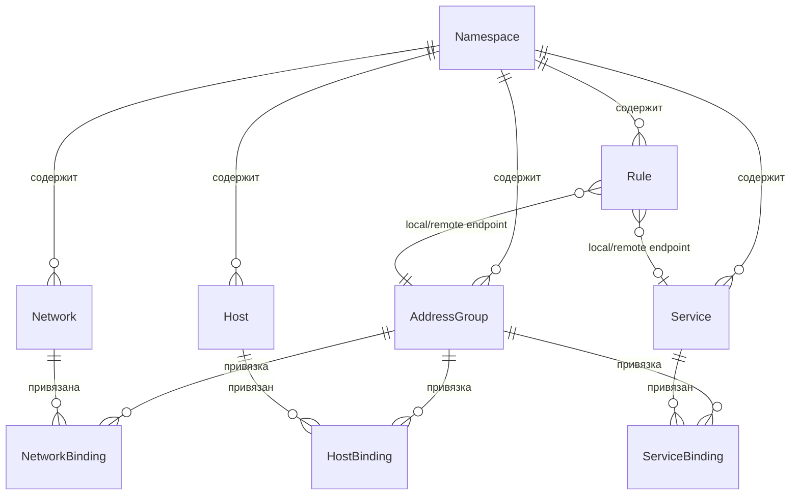

# Введение в SGroups

**SGroups** — Host Based NGFW-система для централизованного управления сетевыми группами безопасности.
Проект решает задачу **сетевой микросегментации**: позволяет описывать политики доступа между хостами,
сервисами и сетями, а затем автоматически применять их в виде правил межсетевого экрана на каждом узле инфраструктуры.

### Зачем нужен SGroups

В современных инфраструктурах количество сервисов и хостов непрерывно растет.
Ручное управление правилами файрвола на каждом узле становится невозможным:

- Правила файрвола рассинхронизируются между хостами при ручном управлении
- Отсутствует единый источник истины для сетевых политик
- Нет наблюдаемости: непонятно, какие правила действуют и где
- Kubernetes-среды требуют отдельного подхода к управлению политиками

SGroups предоставляет **единую точку управления** политиками безопасности с автоматическим
распространением правил на все управляемые узлы.

### Ключевые возможности

<table>
  <thead>
    <tr>
      <th>Возможность</th>
      <th>Описание</th>
    </tr>
  </thead>
  <tbody>
    <tr>
      <td><strong>gRPC + REST API</strong></td>
      <td>Единый API-контракт на Protocol Buffers с автогенерацией REST через gRPC-Gateway</td>
    </tr>
    <tr>
      <td><strong>nftables</strong></td>
      <td>Применение правил через современную подсистему файрвола Linux</td>
    </tr>
    <tr>
      <td><strong>Kubernetes-интеграция</strong></td>
      <td>Aggregated API Server для нативной работы через <code>kubectl</code></td>
    </tr>
    <tr>
      <td><strong>PostgreSQL</strong></td>
      <td>Надежное хранилище конфигурации с поддержкой миграций</td>
    </tr>
    <tr>
      <td><strong>Watch API</strong></td>
      <td>Серверная потоковая передача изменений ресурсов в реальном времени</td>
    </tr>
    <tr>
      <td><strong>Доменная модель</strong></td>
      <td>9 типов ресурсов для гибкого описания сетевых политик</td>
    </tr>
  </tbody>
</table>

## Архитектура

Система построена по модели **«контрольная плоскость — агенты»**: централизованный сервер
хранит конфигурацию и предоставляет API, агенты на каждом хосте применяют правила локально.

## Компоненты

<table>
  <thead>
    <tr>
      <th>Компонент</th>
      <th>Роль</th>
      <th>Ключевые технологии</th>
    </tr>
  </thead>
  <tbody>
    <tr>
      <td><strong>sg-server</strong></td>
      <td>Центральный API-сервер, хранение конфигурации</td>
      <td>gRPC, gRPC-Gateway (REST), PostgreSQL, Goose</td>
    </tr>
    <tr>
      <td><strong>sg-agent</strong></td>
      <td>Применение правил файрвола на хостах</td>
      <td>nftables, DNS-резолвер, периодическая синхронизация</td>
    </tr>
    <tr>
      <td><strong>sgroups-k8s-api</strong></td>
      <td>Kubernetes Aggregated API Server</td>
      <td><code>k8s.io/apiserver</code>, Kustomize, cert-manager</td>
    </tr>
    <tr>
      <td><strong>sgroups-proto</strong></td>
      <td>Центральный API-контракт (Protocol Buffers)</td>
      <td>Buf, gRPC-Gateway, OpenAPI, ConnectRPC</td>
    </tr>
  </tbody>
</table>

## Доменная модель

SGroups использует **9 типов ресурсов**, организованных по принципу Kubernetes — каждый ресурс
содержит `Metadata` (uid, name, namespace, labels, annotations, resource_version) и `Spec`.

<table>
  <thead>
    <tr>
      <th>Ресурс</th>
      <th>Описание</th>
    </tr>
  </thead>
  <tbody>
    <tr>
      <td><strong>Namespace</strong></td>
      <td>Область изоляции ресурсов (разделение по командам, средам, проектам)</td>
    </tr>
    <tr>
      <td><strong>AddressGroup</strong></td>
      <td>Центральная сущность — объединяет хосты, сети и сервисы через привязки; задает <code>default_action</code> (ALLOW/DENY), логирование и трейсинг</td>
    </tr>
    <tr>
      <td><strong>Network</strong></td>
      <td>IP-подсеть в формате CIDR (например, <code>10.0.1.0/24</code>); привязывается к AddressGroup через NetworkBinding</td>
    </tr>
    <tr>
      <td><strong>Host</strong></td>
      <td>Конечный узел инфраструктуры — список IP-адресов, системная метаинформация (hostname, OS, ядро)</td>
    </tr>
    <tr>
      <td><strong>Service</strong></td>
      <td>Транспортная конфигурация — протокол (TCP/UDP/ICMP), диапазоны портов, IP-семейства (IPv4/IPv6)</td>
    </tr>
    <tr>
      <td><strong>HostBinding</strong></td>
      <td>Привязка Host → AddressGroup</td>
    </tr>
    <tr>
      <td><strong>NetworkBinding</strong></td>
      <td>Привязка Network → AddressGroup</td>
    </tr>
    <tr>
      <td><strong>ServiceBinding</strong></td>
      <td>Привязка Service → AddressGroup</td>
    </tr>
    <tr>
      <td><strong>Rule</strong></td>
      <td>Правило сетевой политики — action (ALLOW/DENY), direction (ingress/egress), локальный и удаленный endpoints, транспорт</td>
    </tr>
  </tbody>
</table>

Типы endpoints в правилах: **AddressGroup**, **Service**, **FQDN** (доменное имя, резолвится агентом), **CIDR** (IP-подсеть).

:::tip
Привязки (Bindings) позволяют переиспользовать одни и те же хосты, сети и сервисы
в разных группах адресов без дублирования описаний.
:::

### Связи ресурсов

## API-операции

Все ресурсы поддерживают единый набор операций:

<table>
  <thead>
    <tr>
      <th>Операция</th>
      <th>Описание</th>
    </tr>
  </thead>
  <tbody>
    <tr>
      <td><strong>Upsert</strong></td>
      <td>Создание или обновление ресурса (idempotent)</td>
    </tr>
    <tr>
      <td><strong>Delete</strong></td>
      <td>Удаление ресурса</td>
    </tr>
    <tr>
      <td><strong>List</strong></td>
      <td>Получение списка ресурсов с фильтрацией через FieldSelector / LabelSelector</td>
    </tr>
    <tr>
      <td><strong>Watch</strong></td>
      <td>Серверный gRPC-стрим изменений в реальном времени (события: ADDED, MODIFIED, DELETED)</td>
    </tr>
  </tbody>
</table>

### Селекторы

Операции `List` и `Watch` поддерживают фильтрацию:

- **FieldSelector** — фильтрация по полям ресурса (например, `metadata.name=my-group`)
- **LabelSelector** — фильтрация по меткам (например, `env=production,team=platform`)

### Механизм Watch

Watch API обеспечивает получение изменений в реальном времени через серверный gRPC-стрим.
Параметр `resource_version` позволяет клиенту возобновить стрим с последней известной версии
без потери событий при переподключении.

<table>
  <thead>
    <tr>
      <th>Тип события</th>
      <th>Описание</th>
    </tr>
  </thead>
  <tbody>
    <tr>
      <td><code>ADDED</code></td>
      <td>Ресурс создан</td>
    </tr>
    <tr>
      <td><code>MODIFIED</code></td>
      <td>Ресурс изменен</td>
    </tr>
    <tr>
      <td><code>DELETED</code></td>
      <td>Ресурс удален</td>
    </tr>
  </tbody>
</table>

## Структура репозиториев

<table>
  <thead>
    <tr>
      <th>Репозиторий</th>
      <th>Назначение</th>
    </tr>
  </thead>
  <tbody>
    <tr>
      <td><strong>sgroups</strong></td>
      <td>Основной: <code>sg-server</code>, <code>sg-agent</code>, миграции, конфигурация</td>
    </tr>
    <tr>
      <td><strong>sgroups-proto</strong></td>
      <td>Protocol Buffers определения — центральный API-контракт</td>
    </tr>
    <tr>
      <td><strong>sgroups-k8s-api</strong></td>
      <td>Kubernetes Aggregated API Server</td>
    </tr>
    <tr>
      <td><strong>sgroups-test</strong></td>
      <td>Интеграционные и E2E тесты</td>
    </tr>
  </tbody>
</table>

## Технологический стек

<table>
  <thead>
    <tr>
      <th>Технология</th>
      <th>Применение</th>
    </tr>
  </thead>
  <tbody>
    <tr>
      <td>Go 1.25</td>
      <td>Язык реализации всех компонентов</td>
    </tr>
    <tr>
      <td>Protocol Buffers / Buf</td>
      <td>Центральный контракт API, кодогенерация</td>
    </tr>
    <tr>
      <td>PostgreSQL / pgx v5</td>
      <td>Хранилище конфигурации</td>
    </tr>
    <tr>
      <td>nftables</td>
      <td>Применение правил на хостах</td>
    </tr>
    <tr>
      <td>Kubernetes Aggregated API</td>
      <td>Интеграция с k8s (<code>GenericAPIServer</code>)</td>
    </tr>
    <tr>
      <td>Prometheus</td>
      <td>Метрики (<code>/metrics</code>)</td>
    </tr>
    <tr>
      <td>OpenTelemetry</td>
      <td>Распределенный трейсинг (OTLP-экспорт)</td>
    </tr>
    <tr>
      <td>Goose</td>
      <td>Версионирование схемы БД</td>
    </tr>
    <tr>
      <td>Kustomize + cert-manager</td>
      <td>Деплой в Kubernetes</td>
    </tr>
  </tbody>
</table>

## Для кого этот проект

- **DevOps / SRE-инженеры** — централизованное управление сетевыми политиками
- **Администраторы безопасности** — микросегментация и аудит сетевого доступа
- **Разработчики платформ** — интеграция сетевых политик в CI/CD и IaC

Проект распространяется под лицензией **MIT**.
