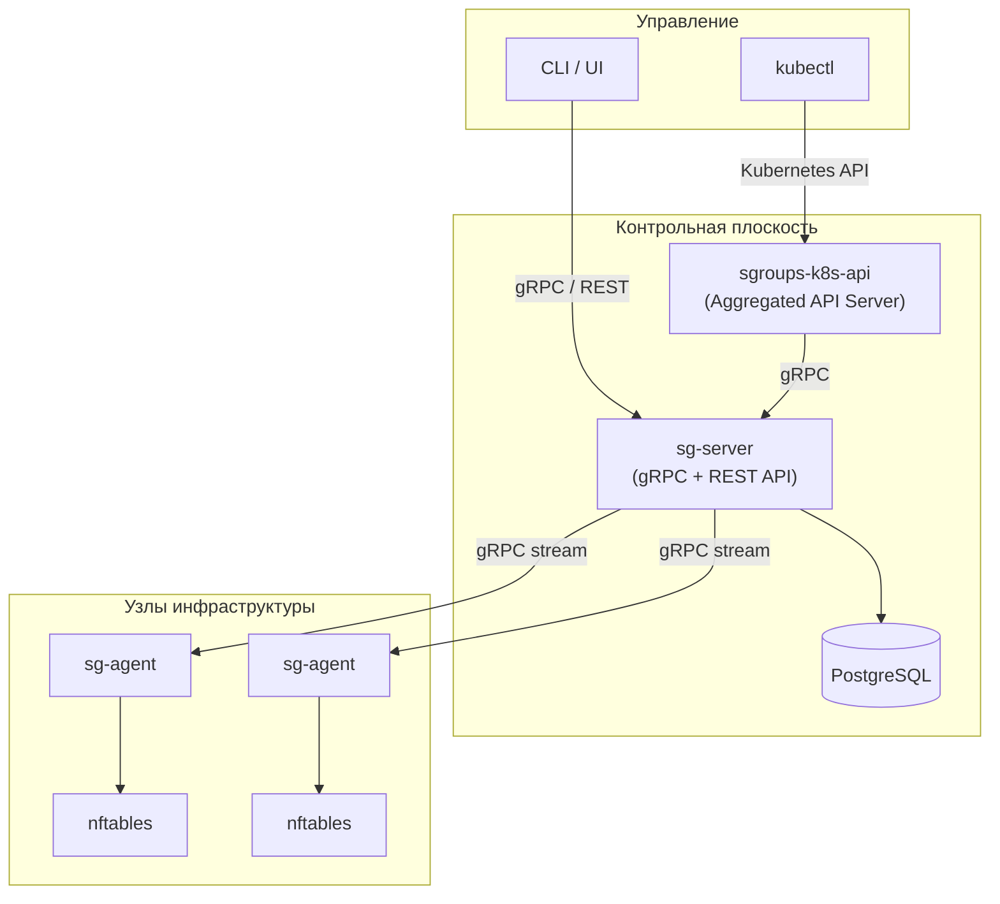
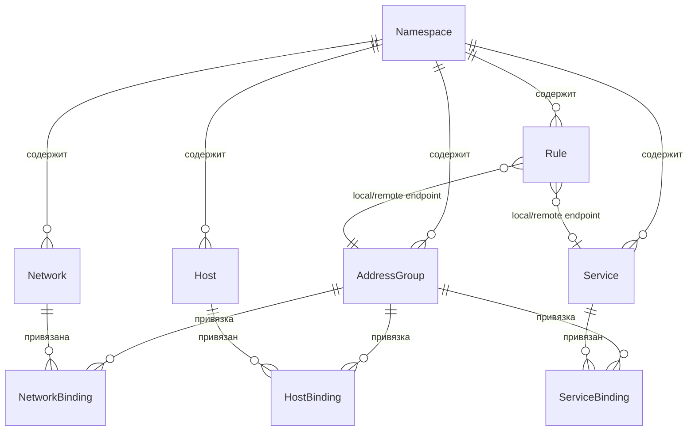

# Введение в SGroups

**SGroups** — Host Based NGFW-система для централизованного управления сетевыми группами безопасности.
Проект решает задачу **сетевой микросегментации**: позволяет описывать политики доступа между хостами,
сервисами и сетями, а затем автоматически применять их в виде правил межсетевого экрана на каждом узле инфраструктуры.

### Зачем нужен SGroups

В современных инфраструктурах количество сервисов и хостов непрерывно растет.
Ручное управление правилами файрвола на каждом узле становится невозможным:

- Правила файрвола рассинхронизируются между хостами при ручном управлении
- Отсутствует единый источник истины для сетевых политик
- Нет наблюдаемости: непонятно, какие правила действуют и где
- Kubernetes-среды требуют отдельного подхода к управлению политиками

SGroups предоставляет **единую точку управления** политиками безопасности с автоматическим
распространением правил на все управляемые узлы.

### Ключевые возможности

| Возможность | Описание |
|---|---|
| **gRPC + REST API** | Единый API-контракт на Protocol Buffers с автогенерацией REST через gRPC-Gateway |
| **nftables** | Применение правил через современную подсистему файрвола Linux |
| **Kubernetes-интеграция** | Aggregated API Server для нативной работы через `kubectl` |
| **PostgreSQL** | Надежное хранилище конфигурации с поддержкой миграций |
| **Watch API** | Серверная потоковая передача изменений ресурсов в реальном времени |
| **Доменная модель** | 9 типов ресурсов для гибкого описания сетевых политик |

## Архитектура

Система построена по модели **«контрольная плоскость — агенты»**: централизованный сервер
хранит конфигурацию и предоставляет API, агенты на каждом хосте применяют правила локально.

## Компоненты

| Компонент | Роль | Ключевые технологии |
|---|---|---|
| **sg-server** | Центральный API-сервер, хранение конфигурации | gRPC, gRPC-Gateway (REST), PostgreSQL, Goose |
| **sg-agent** | Применение правил файрвола на хостах | nftables, DNS-резолвер, периодическая синхронизация |
| **sgroups-k8s-api** | Kubernetes Aggregated API Server | `k8s.io/apiserver`, Kustomize, cert-manager |
| **sgroups-proto** | Центральный API-контракт (Protocol Buffers) | Buf, gRPC-Gateway, OpenAPI, ConnectRPC |

## Доменная модель

SGroups использует **9 типов ресурсов**, организованных по принципу Kubernetes — каждый ресурс
содержит `Metadata` (uid, name, namespace, labels, annotations, resource_version) и `Spec`.

| Ресурс | Описание |
|---|---|
| **Namespace** | Область изоляции ресурсов (разделение по командам, средам, проектам) |
| **AddressGroup** | Центральная сущность — объединяет хосты, сети и сервисы через привязки; задает `default_action` (ALLOW/DENY), логирование и трейсинг |
| **Network** | IP-подсеть в формате CIDR (например, `10.0.1.0/24`); привязывается к AddressGroup через NetworkBinding |
| **Host** | Конечный узел инфраструктуры — список IP-адресов, системная метаинформация (hostname, OS, ядро) |
| **Service** | Транспортная конфигурация — протокол (TCP/UDP/ICMP), диапазоны портов, IP-семейства (IPv4/IPv6) |
| **HostBinding** | Привязка Host → AddressGroup |
| **NetworkBinding** | Привязка Network → AddressGroup |
| **ServiceBinding** | Привязка Service → AddressGroup |
| **Rule** | Правило сетевой политики — action (ALLOW/DENY), direction (ingress/egress), локальный и удаленный endpoints, транспорт |

Типы endpoints в правилах: **AddressGroup**, **Service**, **FQDN** (доменное имя, резолвится агентом), **CIDR** (IP-подсеть).

:::tip
Привязки (Bindings) позволяют переиспользовать одни и те же хосты, сети и сервисы
в разных группах адресов без дублирования описаний.
:::

### Связи ресурсов

## API-операции

Все ресурсы поддерживают единый набор операций:

| Операция | Описание |
|---|---|
| **Upsert** | Создание или обновление ресурса (idempotent) |
| **Delete** | Удаление ресурса |
| **List** | Получение списка ресурсов с фильтрацией через FieldSelector / LabelSelector |
| **Watch** | Серверный gRPC-стрим изменений в реальном времени (события: ADDED, MODIFIED, DELETED) |

### Селекторы

Операции `List` и `Watch` поддерживают фильтрацию:

- **FieldSelector** — фильтрация по полям ресурса (например, `metadata.name=my-group`)
- **LabelSelector** — фильтрация по меткам (например, `env=production,team=platform`)

### Механизм Watch

Watch API обеспечивает получение изменений в реальном времени через серверный gRPC-стрим.
Параметр `resource_version` позволяет клиенту возобновить стрим с последней известной версии
без потери событий при переподключении.

| Тип события | Описание |
|---|---|
| `ADDED` | Ресурс создан |
| `MODIFIED` | Ресурс изменен |
| `DELETED` | Ресурс удален |

## Структура репозиториев

| Репозиторий | Назначение |
|---|---|
| **sgroups** | Основной: `sg-server`, `sg-agent`, миграции, конфигурация |
| **sgroups-proto** | Protocol Buffers определения — центральный API-контракт |
| **sgroups-k8s-api** | Kubernetes Aggregated API Server |
| **sgroups-test** | Интеграционные и E2E тесты |

## Технологический стек

| Технология | Применение |
|---|---|
| Go 1.25 | Язык реализации всех компонентов |
| Protocol Buffers / Buf | Центральный контракт API, кодогенерация |
| PostgreSQL / pgx v5 | Хранилище конфигурации |
| nftables | Применение правил на хостах |
| Kubernetes Aggregated API | Интеграция с k8s (`GenericAPIServer`) |
| Prometheus | Метрики (`/metrics`) |
| OpenTelemetry | Распределенный трейсинг (OTLP-экспорт) |
| Goose | Версионирование схемы БД |
| Kustomize + cert-manager | Деплой в Kubernetes |

## Для кого этот проект

- **DevOps / SRE-инженеры** — централизованное управление сетевыми политиками
- **Администраторы безопасности** — микросегментация и аудит сетевого доступа
- **Разработчики платформ** — интеграция сетевых политик в CI/CD и IaC

Проект распространяется под лицензией **MIT**.
