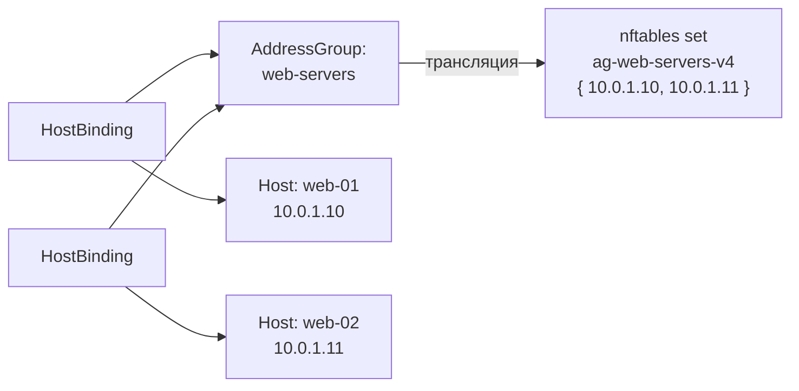

import { DICTIONARY } from '@site/src/constants/dictionary'
import { RESTRICTIONS } from '@site/src/constants/restrictions'
import { Restrictions } from '@site/src/components/commonBlocks/Restrictions'
import CodeBlock from '@theme/CodeBlock'
import dedent from 'ts-dedent'

# Address Groups

**AddressGroup** — центральный ресурс модели SGroups. Группа адресов объединяет хосты,
сети и сервисы через механизм привязок (Bindings) и определяет действие по умолчанию
для трафика, не покрытого явными правилами.

## API

### Создание / обновление

<CodeBlock>
  {dedent`
    POST /v1/address-groups/upsert
  `}
</CodeBlock>

### Поля spec

<table>
  <thead>
    <tr>
      <th>Поле</th>
      <th>Тип</th>
      <th>Описание</th>
    </tr>
  </thead>
  <tbody>
    <tr>
      <td><code>displayName</code></td>
      <td><code>string</code></td>
      <td>{DICTIONARY.displayName.short}</td>
    </tr>
    <tr>
      <td><code>comment</code></td>
      <td><code>string</code></td>
      <td>{DICTIONARY.comment.short}</td>
    </tr>
    <tr>
      <td><code>description</code></td>
      <td><code>string</code></td>
      <td>{DICTIONARY.description.short}</td>
    </tr>
    <tr>
      <td><code>defaultAction</code></td>
      <td><code>Action</code></td>
      <td>{DICTIONARY.defaultAction.short}</td>
    </tr>
    <tr>
      <td><code>logs</code></td>
      <td><code>bool</code></td>
      <td>{DICTIONARY.logs.short}</td>
    </tr>
    <tr>
      <td><code>trace</code></td>
      <td><code>bool</code></td>
      <td>{DICTIONARY.trace.short}</td>
    </tr>
  </tbody>
</table>

<Restrictions items={[
  { label: 'spec.displayName', rules: RESTRICTIONS.displayName },
  { label: 'spec.defaultAction', rules: RESTRICTIONS.action },
]} />

В ответе дополнительно возвращается поле `refs` — массив обратных ссылок (`ResourceRef`) на
связанные Hosts, Networks, Services и Rules.

### Пример curl

<CodeBlock language="bash">
  {dedent`
    curl -X POST http://localhost:9100/v1/address-groups/upsert \\
      -H "Content-Type: application/json" \\
      -d '{
        "name": "web-servers",
        "namespace": "production",
        "spec": {
          "displayName": "Web-серверы",
          "comment": "Frontend-серверы",
          "defaultAction": "DENY",
          "logs": true,
          "trace": false
        }
      }'
  `}
</CodeBlock>

## Kubernetes (АГЛ)

### YAML-манифест

<CodeBlock language="yaml">
  {dedent`
    apiVersion: sgroups.io/v1alpha1
    kind: AddressGroup
    metadata:
      name: web-servers
      namespace: production
      labels:
        env: prod
        tier: frontend
    spec:
      displayName: "Web-серверы"
      comment: "Frontend-серверы Nginx"
      description: "Группа адресов для web-серверов фронтенда"
      defaultAction: Allow
      logs: true
      trace: false
  `}
</CodeBlock>

### Операции kubectl

<CodeBlock language="bash">
  {dedent`
    kubectl get addressgroups -n production
    kubectl describe addressgroup web-servers -n production

    kubectl get addressgroups -o custom-columns=\\
    NAME:.metadata.name,\\
    ACTION:.spec.defaultAction,\\
    LOGS:.spec.logs,\\
    TRACE:.spec.trace
  `}
</CodeBlock>

## Связь с nftables

AddressGroup транслируется в **nftables set** — именованное множество IP-адресов.
Для каждого семейства адресов создаётся отдельный set:

<table>
  <thead>
    <tr>
      <th>Семейство</th>
      <th>Тип set</th>
      <th>Пример имени</th>
    </tr>
  </thead>
  <tbody>
    <tr>
      <td>IPv4</td>
      <td><code>ipv4_addr</code></td>
      <td><code>ag-web-servers-v4</code></td>
    </tr>
    <tr>
      <td>IPv6</td>
      <td><code>ipv6_addr</code></td>
      <td><code>ag-web-servers-v6</code></td>
    </tr>
  </tbody>
</table>

IP-адреса хостов и CIDR сетей, привязанных через HostBinding / NetworkBinding,
заполняют элементы set'а:

<CodeBlock language="bash">
  {dedent`
    set ag-web-servers-v4 {
        type ipv4_addr
        elements = { 10.0.1.10, 10.0.1.11 }
    }

    set ag-web-servers-v6 {
        type ipv6_addr
        elements = { fd00::10, fd00::11 }
    }
  `}
</CodeBlock>

:::tip
`defaultAction` группы определяет политику базовой цепочки, создаваемой для этой группы.
`logs: true` добавляет `log` action перед терминальным действием правил.
:::
