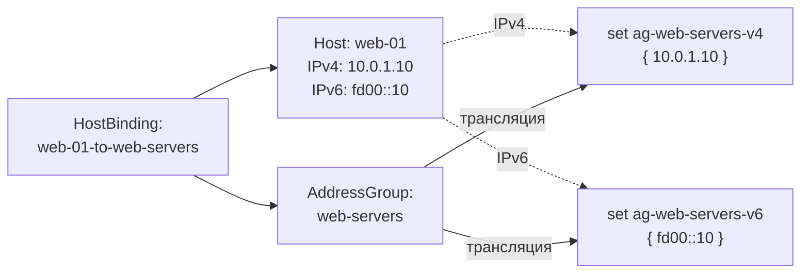

import { DICTIONARY } from '@site/src/constants/dictionary'
import { RESTRICTIONS } from '@site/src/constants/restrictions'
import { Restrictions } from '@site/src/components/commonBlocks/Restrictions'
import CodeBlock from '@theme/CodeBlock'
import dedent from 'ts-dedent'

# Host Bindings

**HostBinding** — ресурс привязки хоста к группе адресов. При создании HostBinding
IP-адреса указанного Host добавляются в nftables set целевой AddressGroup.

## API

### Создание / обновление

<CodeBlock>
  {dedent`
    POST /v1/host-bindings/upsert
  `}
</CodeBlock>

### Поля spec

<table>
  <thead>
    <tr>
      <th>Поле</th>
      <th>Тип</th>
      <th>Описание</th>
    </tr>
  </thead>
  <tbody>
    <tr>
      <td><code>displayName</code></td>
      <td><code>string</code></td>
      <td>{DICTIONARY.displayName.short}</td>
    </tr>
    <tr>
      <td><code>comment</code></td>
      <td><code>string</code></td>
      <td>{DICTIONARY.comment.short}</td>
    </tr>
    <tr>
      <td><code>description</code></td>
      <td><code>string</code></td>
      <td>{DICTIONARY.description.short}</td>
    </tr>
    <tr>
      <td><code>addressGroup</code></td>
      <td><code>ResourceIdentifier</code></td>
      <td>{DICTIONARY.addressGroup.short}</td>
    </tr>
    <tr>
      <td><code>host</code></td>
      <td><code>ResourceIdentifier</code></td>
      <td>{DICTIONARY.host.short}</td>
    </tr>
  </tbody>
</table>

<Restrictions items={[
  { label: 'spec.displayName', rules: RESTRICTIONS.displayName },
]} />

### Пример curl

<CodeBlock language="bash">
  {dedent`
    curl -X POST http://localhost:9100/v1/host-bindings/upsert \\
      -H "Content-Type: application/json" \\
      -d '{
        "name": "web-01-to-web-servers",
        "namespace": "production",
        "spec": {
          "displayName": "web-01 → web-servers",
          "addressGroup": {
            "name": "web-servers",
            "namespace": "production"
          },
          "host": {
            "name": "web-01",
            "namespace": "production"
          }
        }
      }'
  `}
</CodeBlock>

## Kubernetes (АГЛ)

### YAML-манифест

<CodeBlock language="yaml">
  {dedent`
    apiVersion: sgroups.io/v1alpha1
    kind: HostBinding
    metadata:
      name: web-01-to-web-servers
      namespace: production
    spec:
      displayName: "web-01 → web-servers"
      addressGroup:
        name: web-servers
        namespace: production
      host:
        name: web-01
        namespace: production
  `}
</CodeBlock>

### Операции kubectl

<CodeBlock language="bash">
  {dedent`
    kubectl get hostbindings -n production
    kubectl describe hostbinding web-01-to-web-servers -n production

    kubectl get hostbindings -o custom-columns=\\
    NAME:.metadata.name,\\
    AG:.spec.addressGroup.name,\\
    HOST:.spec.host.name
  `}
</CodeBlock>

## Связь с nftables

HostBinding — ключевое звено, создающее связь между Host и nftables set AddressGroup.
При трансляции IP-адреса хоста становятся элементами set'а.

### Схема трансляции

### Результат в nftables

<CodeBlock language="bash">
  {dedent`
    # До привязки — set пуст
    set ag-web-servers-v4 { type ipv4_addr; }

    # После создания HostBinding для web-01 (10.0.1.10) и web-02 (10.0.1.11)
    set ag-web-servers-v4 {
        type ipv4_addr
        elements = { 10.0.1.10, 10.0.1.11 }
    }
  `}
</CodeBlock>

:::info
При удалении HostBinding IP-адреса хоста удаляются из set'а AddressGroup.
Если у хоста обновились IP-адреса (через `upd-ips`), set обновляется
при следующем цикле синхронизации агента.
:::
