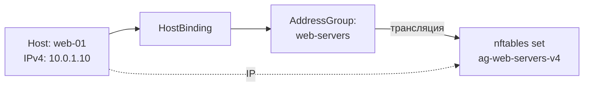

import { DICTIONARY } from '@site/src/constants/dictionary'
import { TYPES } from '@site/src/constants/types'
import { RESTRICTIONS } from '@site/src/constants/restrictions'
import { Restrictions } from '@site/src/components/commonBlocks/Restrictions'
import CodeBlock from '@theme/CodeBlock'
import dedent from 'ts-dedent'

# Hosts

{DICTIONARY.resourceHost.full}

## API

### Создание / обновление

<CodeBlock>
  {dedent`
    POST /v1/hosts/upsert
  `}
</CodeBlock>

### Поля spec

<table>
  <thead>
    <tr>
      <th>Поле</th>
      <th>Тип</th>
      <th>Описание</th>
    </tr>
  </thead>
  <tbody>
    <tr>
      <td><code>displayName</code></td>
      <td><code>{TYPES.string}</code></td>
      <td>{DICTIONARY.displayName.short}</td>
    </tr>
    <tr>
      <td><code>comment</code></td>
      <td><code>{TYPES.string}</code></td>
      <td>{DICTIONARY.comment.short}</td>
    </tr>
    <tr>
      <td><code>description</code></td>
      <td><code>{TYPES.string}</code></td>
      <td>{DICTIONARY.description.short}</td>
    </tr>
  </tbody>
</table>

<Restrictions items={[
  { label: 'spec.displayName', rules: RESTRICTIONS.displayName },
]} />

### Read-only поля (в ответе сервера)

<table>
  <thead>
    <tr>
      <th>Поле</th>
      <th>Тип</th>
      <th>Описание</th>
    </tr>
  </thead>
  <tbody>
    <tr>
      <td><code>ips</code></td>
      <td><code>object</code></td>
      <td>{DICTIONARY.ips.short}</td>
    </tr>
    <tr>
      <td><code>ips.IPv4</code></td>
      <td><code>[]string</code></td>
      <td>{DICTIONARY.ipv4.short}</td>
    </tr>
    <tr>
      <td><code>ips.IPv6</code></td>
      <td><code>[]string</code></td>
      <td>{DICTIONARY.ipv6.short}</td>
    </tr>
    <tr>
      <td><code>metaInfo</code></td>
      <td><code>object</code></td>
      <td>{DICTIONARY.metaInfo.short}</td>
    </tr>
    <tr>
      <td><code>metaInfo.hostName</code></td>
      <td><code>{TYPES.string}</code></td>
      <td>{DICTIONARY.hostName.short}</td>
    </tr>
    <tr>
      <td><code>metaInfo.os</code></td>
      <td><code>{TYPES.string}</code></td>
      <td>{DICTIONARY.os.short}</td>
    </tr>
    <tr>
      <td><code>metaInfo.platform</code></td>
      <td><code>{TYPES.string}</code></td>
      <td>{DICTIONARY.platform.short}</td>
    </tr>
    <tr>
      <td><code>metaInfo.platformFamily</code></td>
      <td><code>{TYPES.string}</code></td>
      <td>{DICTIONARY.platformFamily.short}</td>
    </tr>
    <tr>
      <td><code>metaInfo.platformVersion</code></td>
      <td><code>{TYPES.string}</code></td>
      <td>{DICTIONARY.platformVersion.short}</td>
    </tr>
    <tr>
      <td><code>metaInfo.kernelVersion</code></td>
      <td><code>{TYPES.string}</code></td>
      <td>{DICTIONARY.kernelVersion.short}</td>
    </tr>
  </tbody>
</table>

### Операции обновления read-only полей

<table>
  <thead>
    <tr>
      <th>Операция</th>
      <th>Описание</th>
    </tr>
  </thead>
  <tbody>
    <tr>
      <td><code>upd-ips</code></td>
      <td>{DICTIONARY.ips.short}</td>
    </tr>
    <tr>
      <td><code>upd-metainfo</code></td>
      <td>{DICTIONARY.metaInfo.short}</td>
    </tr>
  </tbody>
</table>

### Пример curl

<CodeBlock language="bash">
  {dedent`
    curl -X POST http://localhost:9100/v1/hosts/upsert \\
      -H "Content-Type: application/json" \\
      -d '{
        "name": "web-01",
        "namespace": "production",
        "spec": {
          "displayName": "Web-сервер 01",
          "comment": "Nginx frontend"
        }
      }'
  `}
</CodeBlock>

## Kubernetes (АГЛ)

### YAML-манифест

<CodeBlock language="yaml">
  {dedent`
    apiVersion: sgroups.io/v1alpha1
    kind: Host
    metadata:
      name: web-01
      namespace: production
    spec:
      displayName: "Web-сервер 01"
      comment: "Nginx frontend"
      description: "Основной web-сервер"
    # Read-only — заполняется сервером:
    ips:
      IPv4:
        - "10.0.1.10"
      IPv6:
        - "fd00::10"
    metaInfo:
      hostName: "web-01.example.com"
      os: "linux"
      platform: "ubuntu"
      platformFamily: "debian"
      platformVersion: "22.04"
      kernelVersion: "6.5.0-44-generic"
  `}
</CodeBlock>

### Операции kubectl

<CodeBlock language="bash">
  {dedent`
    kubectl get hosts -n production
    kubectl describe host web-01 -n production

    kubectl get hosts -o custom-columns=\\
    NAME:.metadata.name,\\
    IPv4:.ips.IPv4,\\
    IPv6:.ips.IPv6
  `}
</CodeBlock>

## Связь с nftables

Сам ресурс Host не создает nftables-объектов. IP-адреса хоста добавляются как элементы
в set родительской AddressGroup при создании **HostBinding**.

<CodeBlock language="bash">
  {dedent`
    # После привязки host "web-01" (10.0.1.10) и "web-02" (10.0.1.11)
    # к AddressGroup "web-servers"
    add element inet sgroups ag-web-servers-v4 { 10.0.1.10, 10.0.1.11 }
  `}
</CodeBlock>

### Полная цепочка трансляции

:::info
IP-адреса и метаинформация обновляются автоматически агентом (`sg-agent`) при каждом цикле
синхронизации через операции `upd-ips` и `upd-metainfo`.
:::
