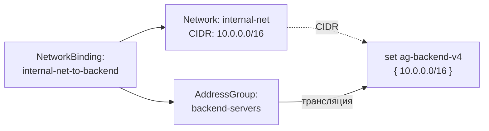

import { DICTIONARY } from '@site/src/constants/dictionary'
import { RESTRICTIONS } from '@site/src/constants/restrictions'
import { Restrictions } from '@site/src/components/commonBlocks/Restrictions'
import CodeBlock from '@theme/CodeBlock'
import dedent from 'ts-dedent'

# Network Bindings

**NetworkBinding** — ресурс привязки сети к группе адресов. При создании NetworkBinding
CIDR указанной Network добавляется в nftables set целевой AddressGroup.

## API

### Создание / обновление

<CodeBlock>
  {dedent`
    POST /v1/network-bindings/upsert
  `}
</CodeBlock>

### Поля spec

<table>
  <thead>
    <tr>
      <th>Поле</th>
      <th>Тип</th>
      <th>Описание</th>
    </tr>
  </thead>
  <tbody>
    <tr>
      <td><code>addressGroup</code></td>
      <td><code>ResourceIdentifier</code></td>
      <td>{DICTIONARY.addressGroup.short}</td>
    </tr>
    <tr>
      <td><code>network</code></td>
      <td><code>ResourceIdentifier</code></td>
      <td>{DICTIONARY.network.short}</td>
    </tr>
  </tbody>
</table>

### Пример curl

<CodeBlock language="bash">
  {dedent`
    curl -X POST http://localhost:9100/v1/network-bindings/upsert \\
      -H "Content-Type: application/json" \\
      -d '{
        "name": "internal-net-to-backend",
        "namespace": "production",
        "spec": {
          "addressGroup": {
            "name": "backend-servers",
            "namespace": "production"
          },
          "network": {
            "name": "internal-net",
            "namespace": "production"
          }
        }
      }'
  `}
</CodeBlock>

## Kubernetes (АГЛ)

### YAML-манифест

<CodeBlock language="yaml">
  {dedent`
    apiVersion: sgroups.io/v1alpha1
    kind: NetworkBinding
    metadata:
      name: internal-net-to-backend
      namespace: production
    spec:
      addressGroup:
        name: backend-servers
        namespace: production
      network:
        name: internal-net
        namespace: production
  `}
</CodeBlock>

### Операции kubectl

<CodeBlock language="bash">
  {dedent`
    kubectl get networkbindings -n production
    kubectl describe networkbinding internal-net-to-backend -n production

    kubectl get networkbindings -o custom-columns=\\
    NAME:.metadata.name,\\
    AG:.spec.addressGroup.name,\\
    NETWORK:.spec.network.name
  `}
</CodeBlock>

## Связь с nftables

NetworkBinding работает аналогично HostBinding, но вместо IP-адресов хоста
добавляет CIDR сети в nftables set AddressGroup.

### Схема трансляции

### Результат в nftables

<CodeBlock language="bash">
  {dedent`
    # CIDR сети добавляется как элемент set с флагом interval
    set ag-backend-v4 {
        type ipv4_addr
        flags interval
        elements = { 10.0.0.0/16, 172.16.0.0/24 }
    }
  `}
</CodeBlock>

<CodeBlock language="bash">
  {dedent`
    # Добавление элемента при создании привязки
    add element inet sgroups ag-backend-v4 { 10.0.0.0/16 }
  `}
</CodeBlock>

:::info
В одном set AddressGroup могут сосуществовать IP-адреса хостов (из HostBinding)
и CIDR сетей (из NetworkBinding). nftables с флагом `interval` поддерживает
оба типа элементов в одном наборе.
:::
