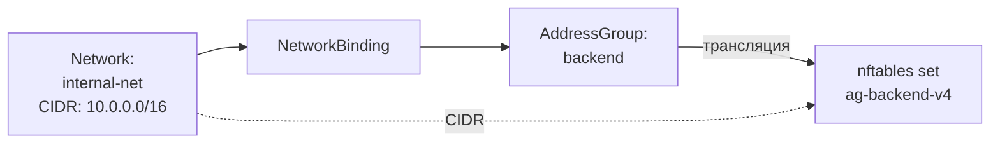

import { DICTIONARY } from '@site/src/constants/dictionary'
import { TYPES } from '@site/src/constants/types'
import { RESTRICTIONS } from '@site/src/constants/restrictions'
import { Restrictions } from '@site/src/components/commonBlocks/Restrictions'
import CodeBlock from '@theme/CodeBlock'
import dedent from 'ts-dedent'

# Networks

{DICTIONARY.resourceNetwork.full}

## API

### Создание / обновление

<CodeBlock>
  {dedent`
    POST /v1/networks/upsert
  `}
</CodeBlock>

### Поля spec

<table>
  <thead>
    <tr>
      <th>Поле</th>
      <th>Тип</th>
      <th>Описание</th>
    </tr>
  </thead>
  <tbody>
    <tr>
      <td><code>displayName</code></td>
      <td><code>{TYPES.string}</code></td>
      <td>{DICTIONARY.displayName.short}</td>
    </tr>
    <tr>
      <td><code>comment</code></td>
      <td><code>{TYPES.string}</code></td>
      <td>{DICTIONARY.comment.short}</td>
    </tr>
    <tr>
      <td><code>description</code></td>
      <td><code>{TYPES.string}</code></td>
      <td>{DICTIONARY.description.short}</td>
    </tr>
    <tr>
      <td><code>CIDR</code></td>
      <td><code>{TYPES.string}</code></td>
      <td>{DICTIONARY.cidr.short}</td>
    </tr>
  </tbody>
</table>

<Restrictions items={[
  { label: 'spec.displayName', rules: RESTRICTIONS.displayName },
  { label: 'spec.CIDR', rules: RESTRICTIONS.cidr },
]} />

### Пример curl

<CodeBlock language="bash">
  {dedent`
    curl -X POST http://localhost:9100/v1/networks/upsert \\
      -H "Content-Type: application/json" \\
      -d '{
        "name": "internal-net",
        "namespace": "production",
        "spec": {
          "displayName": "Внутренняя сеть",
          "comment": "Основная сеть ДЦ",
          "CIDR": "10.0.0.0/16"
        }
      }'
  `}
</CodeBlock>

## Kubernetes (АГЛ)

### YAML-манифест

<CodeBlock language="yaml">
  {dedent`
    apiVersion: sgroups.io/v1alpha1
    kind: Network
    metadata:
      name: internal-net
      namespace: production
    spec:
      displayName: "Внутренняя сеть"
      comment: "Основная сеть ДЦ"
      description: "Подсеть 10.0.0.0/16 основного дата-центра"
      CIDR: "10.0.0.0/16"
  `}
</CodeBlock>

### Операции kubectl

<CodeBlock language="bash">
  {dedent`
    kubectl get networks -n production
    kubectl describe network internal-net -n production

    kubectl get networks -o custom-columns=\\
    NAME:.metadata.name,\\
    CIDR:.spec.CIDR
  `}
</CodeBlock>

## Связь с nftables

Сам ресурс Network не создает собственных nftables-объектов. CIDR сети добавляется как
элемент в set родительской AddressGroup при создании **NetworkBinding**.

<CodeBlock language="bash">
  {dedent`
    # После привязки network "internal-net" (10.0.0.0/16) к AddressGroup "backend"
    add element inet sgroups ag-backend-v4 { 10.0.0.0/16 }
  `}
</CodeBlock>

### Полная цепочка трансляции

Если к одной AddressGroup привязано несколько сетей и хостов, все их адреса
объединяются в одном set:

<CodeBlock language="bash">
  {dedent`
    set ag-backend-v4 {
        type ipv4_addr
        flags interval
        elements = { 10.0.0.0/16, 172.16.0.0/24 }
    }
  `}
</CodeBlock>

:::info
Для CIDR-элементов nftables set использует флаг `interval`, позволяющий хранить
подсети, а не только отдельные IP-адреса.
:::
