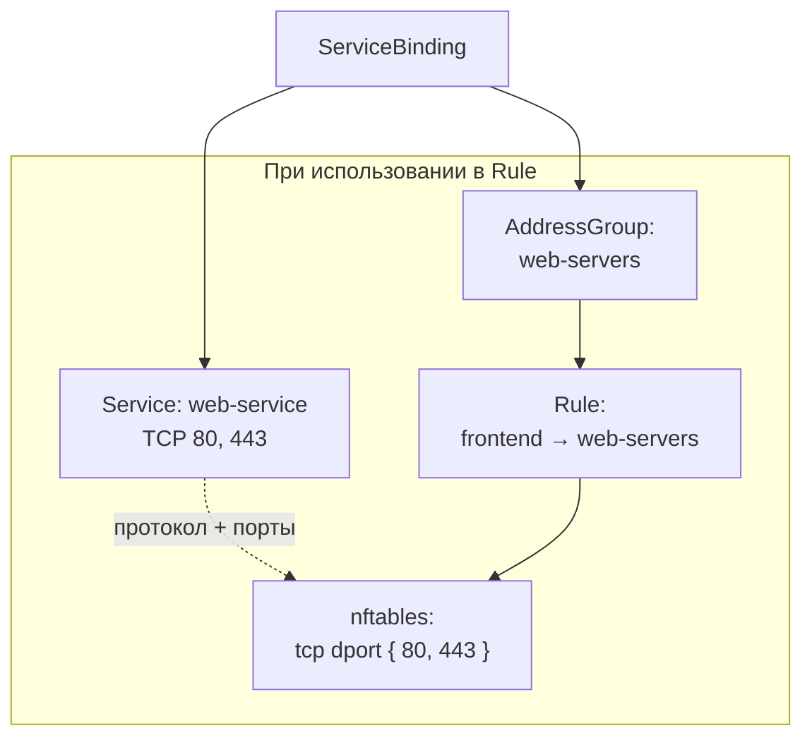

import { DICTIONARY } from '@site/src/constants/dictionary'
import { TYPES } from '@site/src/constants/types'
import { RESTRICTIONS } from '@site/src/constants/restrictions'
import { Restrictions } from '@site/src/components/commonBlocks/Restrictions'
import CodeBlock from '@theme/CodeBlock'
import dedent from 'ts-dedent'

# Service Bindings

{DICTIONARY.resourceServiceBinding.full}

## API

### Создание / обновление

<CodeBlock>
  {dedent`
    POST /v1/service-bindings/upsert
  `}
</CodeBlock>

### Поля spec

<table>
  <thead>
    <tr>
      <th>Поле</th>
      <th>Тип</th>
      <th>Описание</th>
    </tr>
  </thead>
  <tbody>
    <tr>
      <td><code>addressGroup</code></td>
      <td><code>{TYPES.resourceIdentifier}</code></td>
      <td>{DICTIONARY.addressGroup.short}</td>
    </tr>
    <tr>
      <td><code>service</code></td>
      <td><code>{TYPES.resourceIdentifier}</code></td>
      <td>{DICTIONARY.service.short}</td>
    </tr>
  </tbody>
</table>

### Пример curl

<CodeBlock language="bash">
  {dedent`
    curl -X POST http://localhost:9100/v1/service-bindings/upsert \\
      -H "Content-Type: application/json" \\
      -d '{
        "name": "web-svc-to-web-servers",
        "namespace": "production",
        "spec": {
          "addressGroup": {
            "name": "web-servers",
            "namespace": "production"
          },
          "service": {
            "name": "web-service",
            "namespace": "production"
          }
        }
      }'
  `}
</CodeBlock>

## Kubernetes (АГЛ)

### YAML-манифест

<CodeBlock language="yaml">
  {dedent`
    apiVersion: sgroups.io/v1alpha1
    kind: ServiceBinding
    metadata:
      name: web-svc-to-web-servers
      namespace: production
    spec:
      addressGroup:
        name: web-servers
        namespace: production
      service:
        name: web-service
        namespace: production
  `}
</CodeBlock>

### Операции kubectl

<CodeBlock language="bash">
  {dedent`
    kubectl get servicebindings -n production
    kubectl describe servicebinding web-svc-to-web-servers -n production

    kubectl get servicebindings -o custom-columns=\\
    NAME:.metadata.name,\\
    AG:.spec.addressGroup.name,\\
    SERVICE:.spec.service.name
  `}
</CodeBlock>

## Связь с nftables

ServiceBinding связывает транспортную конфигурацию Service с AddressGroup.
Эта связь определяет, какие протоколы и порты будут использоваться при матчинге
трафика в правилах nftables, когда данная AddressGroup выступает эндпоинтом Rule.

### Схема трансляции

### Пример результата

Когда AddressGroup `web-servers` с привязанным Service `web-service` (TCP 80, 443)
используется как эндпоинт в Rule:

<CodeBlock language="bash">
  {dedent`
    # Результирующее nftables-правило включает транспортный матч из Service
    ip saddr @ag-frontend-v4 ip daddr @ag-web-servers-v4 tcp dport { 80, 443 } accept
  `}
</CodeBlock>

:::info
Одна AddressGroup может иметь несколько ServiceBinding с разными сервисами.
Каждый сервис добавляет свои транспортные конфигурации к набору возможных матчей.
:::
