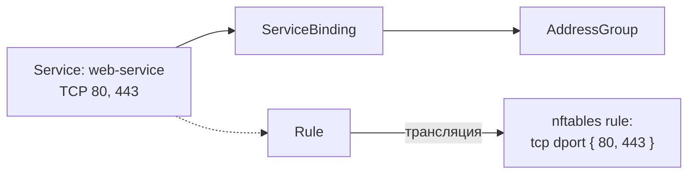

import { DICTIONARY } from '@site/src/constants/dictionary'
import { RESTRICTIONS } from '@site/src/constants/restrictions'
import { Restrictions } from '@site/src/components/commonBlocks/Restrictions'
import CodeBlock from '@theme/CodeBlock'
import dedent from 'ts-dedent'

# Services

{DICTIONARY.resourceService.full}

## API

### Создание / обновление

<CodeBlock>
  {dedent`
    POST /v1/services/upsert
  `}
</CodeBlock>

### Поля spec

<table>
  <thead>
    <tr>
      <th>Поле</th>
      <th>Тип</th>
      <th>Описание</th>
    </tr>
  </thead>
  <tbody>
    <tr>
      <td><code>displayName</code></td>
      <td><code>string</code></td>
      <td>{DICTIONARY.displayName.short}</td>
    </tr>
    <tr>
      <td><code>comment</code></td>
      <td><code>string</code></td>
      <td>{DICTIONARY.comment.short}</td>
    </tr>
    <tr>
      <td><code>description</code></td>
      <td><code>string</code></td>
      <td>{DICTIONARY.description.short}</td>
    </tr>
    <tr>
      <td><code>transports[]</code></td>
      <td><code>ServiceTransport[]</code></td>
      <td>{DICTIONARY.transports.short}</td>
    </tr>
  </tbody>
</table>

<Restrictions items={[
  { label: 'spec.displayName', rules: RESTRICTIONS.displayName },
]} />

### ServiceTransport

<table>
  <thead>
    <tr>
      <th>Поле</th>
      <th>Тип</th>
      <th>Описание</th>
    </tr>
  </thead>
  <tbody>
    <tr>
      <td><code>protocol</code></td>
      <td><code>Protocol</code></td>
      <td>{DICTIONARY.protocol.short}</td>
    </tr>
    <tr>
      <td><code>IPv</code></td>
      <td><code>IpAddrFamily</code></td>
      <td>{DICTIONARY.ipv.short}</td>
    </tr>
    <tr>
      <td><code>entries[]</code></td>
      <td><code>ServiceTransportEntry[]</code></td>
      <td>{DICTIONARY.entries.short}</td>
    </tr>
  </tbody>
</table>

<Restrictions items={[
  { label: 'transport.protocol', rules: RESTRICTIONS.protocol },
  { label: 'transport.ipv', rules: RESTRICTIONS.ipv },
]} />

### ServiceTransportEntry

<table>
  <thead>
    <tr>
      <th>Поле</th>
      <th>Тип</th>
      <th>Описание</th>
    </tr>
  </thead>
  <tbody>
    <tr>
      <td><code>description</code></td>
      <td><code>Enum("TCP", "UDP", "ICMP")</code></td>
      <td>{DICTIONARY.description.short}</td>
    </tr>
    <tr>
      <td><code>comment</code></td>
      <td><code>Enum("IPv4", "IPv6")</code></td>
      <td>{DICTIONARY.comment.short}</td>
    </tr>
    <tr>
      <td><code>ports</code></td>
      <td><code>string</code></td>
      <td>{DICTIONARY.ports.short}</td>
    </tr>
    <tr>
      <td><code>types</code></td>
      <td><code>[]uint32</code></td>
      <td>{DICTIONARY.icmpTypes.short}</td>
    </tr>
  </tbody>
</table>

<Restrictions items={[
  { label: 'entries[].ports', rules: RESTRICTIONS.ports },
  { label: 'entries[].types', rules: RESTRICTIONS.icmpType },
]} />

### Пример curl

<CodeBlock language="bash">
  {dedent`
    curl -X POST http://localhost:9100/v1/services/upsert \\
      -H "Content-Type: application/json" \\
      -d '{
        "name": "web-service",
        "namespace": "production",
        "spec": {
          "displayName": "Web-сервис",
          "transports": [
            {
              "protocol": "TCP",
              "IPv": "IPv4",
              "entries": [
                {"description": "HTTP", "ports": "80"},
                {"description": "HTTPS", "ports": "443"}
              ]
            }
          ]
        }
      }'
  `}
</CodeBlock>

## Kubernetes (АГЛ)

### YAML-манифест

<CodeBlock language="yaml">
  {dedent`
    apiVersion: sgroups.io/v1alpha1
    kind: Service
    metadata:
      name: web-service
      namespace: production
    spec:
      displayName: "Web-сервис"
      comment: "HTTP + HTTPS"
      transports:
        - protocol: TCP
          IPv: IPv4
          entries:
            - description: "HTTP"
              ports: "80"
            - description: "HTTPS"
              ports: "443"
        - protocol: TCP
          IPv: IPv6
          entries:
            - description: "HTTP/HTTPS IPv6"
              ports: "80,443"
        - protocol: ICMP
          IPv: IPv4
          entries:
            - description: "Echo request/reply"
              types: [0, 8]
  `}
</CodeBlock>

### Операции kubectl

<CodeBlock language="bash">
  {dedent`
    kubectl get services.sgroups.io -n production
    kubectl describe service.sgroups.io web-service -n production
  `}
</CodeBlock>

## Связь с nftables

Service определяет **критерии транспортного совпадения** в правилах nftables.
Сам по себе ресурс Service не создает nftables-объектов, но при использовании в Rule
его конфигурация транслируется в протокол и порты:

<table>
  <thead>
    <tr>
      <th>Конфигурация Service</th>
      <th>nftables-выражение</th>
    </tr>
  </thead>
  <tbody>
    <tr>
      <td>TCP, ports: 80, 443</td>
      <td><code>tcp dport {'{ 80, 443 }'}</code></td>
    </tr>
    <tr>
      <td>UDP, ports: 53</td>
      <td><code>udp dport 53</code></td>
    </tr>
    <tr>
      <td>ICMP, types: [0, 8]</td>
      <td><code>{'icmp type { echo-request, echo-reply }'}</code></td>
    </tr>
  </tbody>
</table>

### Пример трансляции

<CodeBlock language="bash">
  {dedent`
    # Service "web-service" с TCP портами 80, 443
    # В правиле nftables это превратится в:
    tcp dport { 80, 443 }

    # Service с ICMP echo-request (8) и echo-reply (0):
    icmp type { echo-request, echo-reply }
  `}
</CodeBlock>

:::tip
Диапазоны портов задаются через дефис: `"8080-8090"`. Несколько портов — через запятую: `"80,443,8080"`.
:::
