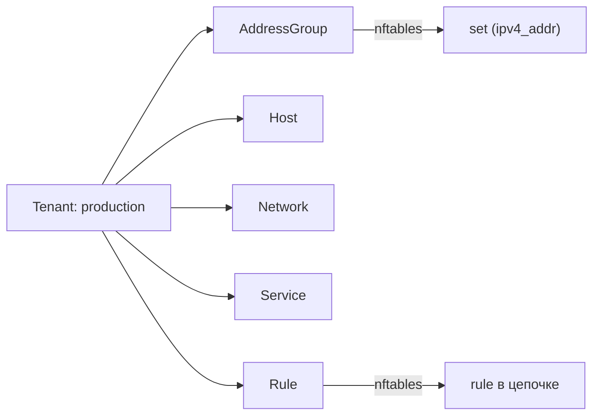

import { DICTIONARY } from '@site/src/constants/dictionary'
import { RESTRICTIONS } from '@site/src/constants/restrictions'
import { Restrictions } from '@site/src/components/commonBlocks/Restrictions'
import CodeBlock from '@theme/CodeBlock'
import dedent from 'ts-dedent'

# Tenant / Namespace

{DICTIONARY.resourceNamespace.full}

## API

### Создание / обновление

<CodeBlock>
  {dedent`
    POST /v1/namespaces/upsert
  `}
</CodeBlock>

### Поля spec

<table>
  <thead>
    <tr>
      <th>Поле</th>
      <th>Тип</th>
      <th>Описание</th>
    </tr>
  </thead>
  <tbody>
    <tr>
      <td><code>displayName</code></td>
      <td><code>string</code></td>
      <td>{DICTIONARY.displayName.short}</td>
    </tr>
    <tr>
      <td><code>comment</code></td>
      <td><code>string</code></td>
      <td>{DICTIONARY.comment.short}</td>
    </tr>
    <tr>
      <td><code>description</code></td>
      <td><code>string</code></td>
      <td>{DICTIONARY.description.short}</td>
    </tr>
  </tbody>
</table>

<Restrictions items={[
  { label: 'spec.displayName', rules: RESTRICTIONS.displayName },
]} />

### Пример curl

<CodeBlock language="bash">
  {dedent`
    curl -X POST http://localhost:9100/v1/namespaces/upsert \\
      -H "Content-Type: application/json" \\
      -d '{
        "name": "production",
        "spec": {
          "displayName": "Продуктивная среда",
          "comment": "Основная рабочая среда",
          "description": "Тенант для production-сервисов"
        }
      }'
  `}
</CodeBlock>

## Kubernetes (АГЛ)

### YAML-манифест

<CodeBlock language="yaml">
  {dedent`
    apiVersion: sgroups.io/v1alpha1
    kind: Tenant
    metadata:
      name: production
    spec:
      displayName: "Продуктивная среда"
      comment: "Основная рабочая среда"
      description: "Тенант для production-сервисов"
  `}
</CodeBlock>

### Операции kubectl

<CodeBlock language="bash">
  {dedent`
    # Создание
    kubectl apply -f tenant.yaml

    # Просмотр
    kubectl get tenants
    kubectl describe tenant production

    # Удаление
    kubectl delete tenant production
  `}
</CodeBlock>

## Связь с nftables

Tenant / Namespace **не транслируются** напрямую в объекты nftables. Они выполняют
исключительно организационную роль — обеспечивают пространство имен для остальных ресурсов.

Все nftables-объекты (sets, chains, rules) именуются с учетом Tenant, но сам Tenant
не порождает отдельную таблицу или цепочку.

:::info
Tenant определяет область видимости: ресурсы из разных тенантов изолированы друг от друга.
Перекрестные ссылки между тенантами возможны через явное указание `namespace` в привязках.
:::
