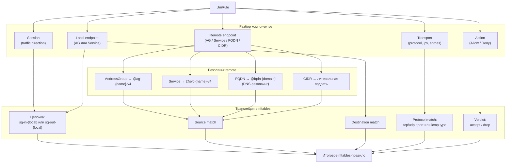
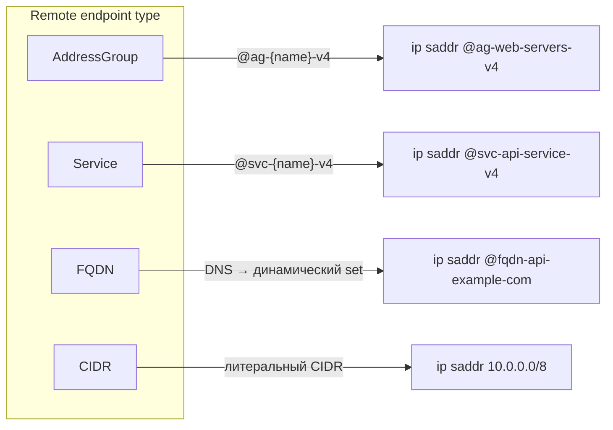

import { DICTIONARY } from '@site/src/constants/dictionary'
import { RESTRICTIONS } from '@site/src/constants/restrictions'
import { Restrictions } from '@site/src/components/commonBlocks/Restrictions'
import Tabs from '@theme/Tabs'
import TabItem from '@theme/TabItem'
import CodeBlock from '@theme/CodeBlock'
import dedent from 'ts-dedent'

# UniRule

{DICTIONARY.resourceUniRule.full}

---

## API

### Общие поля spec

Независимо от комбинации эндпоинтов каждое правило содержит следующие поля:

<table>
  <thead>
    <tr>
      <th>Поле</th>
      <th>Тип</th>
      <th>Описание</th>
    </tr>
  </thead>
  <tbody>
    <tr>
      <td><code>displayName</code></td>
      <td>string</td>
      <td>{DICTIONARY.displayName.short}</td>
    </tr>
    <tr>
      <td><code>comment</code></td>
      <td>string</td>
      <td>{DICTIONARY.comment.short}</td>
    </tr>
    <tr>
      <td><code>description</code></td>
      <td>string</td>
      <td>{DICTIONARY.description.short}</td>
    </tr>
    <tr>
      <td><code>action</code></td>
      <td>Action</td>
      <td>{DICTIONARY.action.short}</td>
    </tr>
    <tr>
      <td><code>session.traffic</code></td>
      <td>Traffic</td>
      <td>{DICTIONARY.traffic.short}</td>
    </tr>
    <tr>
      <td><code>endpoints.local</code></td>
      <td>RuleEndpoint</td>
      <td>{DICTIONARY.local.short}</td>
    </tr>
    <tr>
      <td><code>endpoints.remote</code></td>
      <td>RuleEndpoint</td>
      <td>{DICTIONARY.remote.short}</td>
    </tr>
    <tr>
      <td><code>transport</code></td>
      <td>RuleTransport</td>
      <td>{DICTIONARY.transport.short}</td>
    </tr>
  </tbody>
</table>

### RuleEndpoint

<table>
  <thead>
    <tr>
      <th>Поле</th>
      <th>Тип</th>
      <th>Описание</th>
    </tr>
  </thead>
  <tbody>
    <tr>
      <td><code>name</code></td>
      <td>string</td>
      <td>{DICTIONARY.endpointName.short}</td>
    </tr>
    <tr>
      <td><code>namespace</code></td>
      <td>string</td>
      <td>Namespace эндпоинта</td>
    </tr>
    <tr>
      <td><code>type</code></td>
      <td>EndpointType</td>
      <td>{DICTIONARY.endpointType.short}</td>
    </tr>
    <tr>
      <td><code>value</code></td>
      <td>string</td>
      <td>{DICTIONARY.value.short}</td>
    </tr>
    <tr>
      <td><code>labels</code></td>
      <td>map</td>
      <td>{DICTIONARY.labels.short}</td>
    </tr>
  </tbody>
</table>

### RuleTransport

<table>
  <thead>
    <tr>
      <th>Поле</th>
      <th>Тип</th>
      <th>Описание</th>
    </tr>
  </thead>
  <tbody>
    <tr>
      <td><code>protocol</code></td>
      <td>string</td>
      <td>{DICTIONARY.protocol.short}</td>
    </tr>
    <tr>
      <td><code>ipv</code></td>
      <td>string</td>
      <td>{DICTIONARY.ipv.short}</td>
    </tr>
    <tr>
      <td><code>entries</code></td>
      <td>Entry[]</td>
      <td>{DICTIONARY.entries.short}</td>
    </tr>
  </tbody>
</table>

### Ограничения

<Restrictions items={[
  { label: 'spec.action', rules: RESTRICTIONS.action },
  { label: 'spec.session.traffic', rules: RESTRICTIONS.traffic },
  { label: 'endpoints.*.type', rules: RESTRICTIONS.endpointType },
  { label: 'transport.protocol', rules: RESTRICTIONS.protocol },
  { label: 'transport.ipv', rules: RESTRICTIONS.ipv },
  { label: 'metadata.name', rules: RESTRICTIONS.name },
  { label: 'metadata / spec', rules: RESTRICTIONS.metadataRequired },
]} />

### Пример curl (AG → AG)

<CodeBlock language="bash">
  {dedent`
    curl -X POST http://localhost:9006/v1/rules/upsert \\
      -H "Content-Type: application/json" \\
      -d '{
        "resource": {
          "metadata": {
            "name": "allow-web-to-db",
            "namespace": "production"
          },
          "spec": {
            "action": "ALLOW",
            "session": { "traffic": "EGRESS" },
            "endpoints": {
              "local": {
                "name": "web-servers",
                "namespace": "production",
                "type": "ADDRESS_GROUP"
              },
              "remote": {
                "name": "db-servers",
                "namespace": "production",
                "type": "ADDRESS_GROUP"
              }
            },
            "transport": {
              "protocol": "TCP",
              "IPv": "IPv4",
              "entries": [{ "ports": "5432" }]
            }
          }
        }
      }'
  `}
</CodeBlock>

Подробные примеры для всех 8 комбинаций — в разделе [API UniRule](/api/uni-rule).

---

## Kubernetes (АГЛ)

Каждая комбинация эндпоинтов описывается единым Kind `Rule`. Отличается только содержимое
`spec.endpoints` и наличие поля `value` для FQDN/CIDR.

<Tabs>

<TabItem value="ag-ag" label="AG → AG" default>

Обе стороны — адресные группы. Самый распространенный сценарий.

<CodeBlock language="yaml">
  {dedent`
    apiVersion: sgroups.io/v1alpha1
    kind: Rule
    metadata:
      name: allow-web-to-db
      namespace: production
      labels:
        policy: web-access
    spec:
      displayName: "Web → DB"
      comment: "Разрешить трафик от веб-серверов к БД"
      action: Allow
      session:
        traffic: Egress
      endpoints:
        local:
          name: web-servers
          namespace: production
          type: AddressGroup
        remote:
          name: db-servers
          namespace: production
          type: AddressGroup
      transport:
        protocol: TCP
        IPv: IPv4
        entries:
          - description: "PostgreSQL"
            ports: "5432"
  `}
</CodeBlock>

<Restrictions items={[
  { label: 'metadata.name', rules: RESTRICTIONS.name },
  { label: 'spec.action', rules: RESTRICTIONS.action },
  { label: 'endpoints.*.type', rules: RESTRICTIONS.endpointType },
]} />

</TabItem>

<TabItem value="ag-svc" label="AG → Service">

Локальная сторона — адресная группа, удаленная — сервис.

<CodeBlock language="yaml">
  {dedent`
    apiVersion: sgroups.io/v1alpha1
    kind: Rule
    metadata:
      name: allow-web-to-api-svc
      namespace: production
    spec:
      action: Allow
      session:
        traffic: Egress
      endpoints:
        local:
          name: web-servers
          namespace: production
          type: AddressGroup
        remote:
          name: api-service
          namespace: production
          type: Service
      transport:
        protocol: TCP
        IPv: IPv4
        entries:
          - description: "HTTPS"
            ports: "443"
  `}
</CodeBlock>

<Restrictions items={[
  { label: 'metadata.name', rules: RESTRICTIONS.name },
  { label: 'spec.action', rules: RESTRICTIONS.action },
  { label: 'endpoints.*.type', rules: RESTRICTIONS.endpointType },
]} />

</TabItem>

<TabItem value="svc-ag" label="Service → AG">

Локальная сторона — сервис, удаленная — адресная группа.

<CodeBlock language="yaml">
  {dedent`
    apiVersion: sgroups.io/v1alpha1
    kind: Rule
    metadata:
      name: allow-cache-svc-to-backend
      namespace: production
    spec:
      action: Allow
      session:
        traffic: Ingress
      endpoints:
        local:
          name: cache-service
          namespace: production
          type: Service
        remote:
          name: backend-servers
          namespace: production
          type: AddressGroup
      transport:
        protocol: TCP
        IPv: IPv4
        entries:
          - description: "Redis"
            ports: "6379"
  `}
</CodeBlock>

<Restrictions items={[
  { label: 'metadata.name', rules: RESTRICTIONS.name },
  { label: 'spec.action', rules: RESTRICTIONS.action },
  { label: 'endpoints.*.type', rules: RESTRICTIONS.endpointType },
]} />

</TabItem>

<TabItem value="svc-svc" label="Service → Service">

Обе стороны — сервисы.

<CodeBlock language="yaml">
  {dedent`
    apiVersion: sgroups.io/v1alpha1
    kind: Rule
    metadata:
      name: allow-api-to-cache
      namespace: production
    spec:
      action: Allow
      session:
        traffic: Both
      endpoints:
        local:
          name: api-service
          namespace: production
          type: Service
        remote:
          name: cache-service
          namespace: production
          type: Service
      transport:
        protocol: TCP
        IPv: IPv4
        entries:
          - description: "Redis"
            ports: "6379"
  `}
</CodeBlock>

<Restrictions items={[
  { label: 'metadata.name', rules: RESTRICTIONS.name },
  { label: 'spec.action', rules: RESTRICTIONS.action },
  { label: 'endpoints.*.type', rules: RESTRICTIONS.endpointType },
]} />

</TabItem>

<TabItem value="ag-fqdn" label="AG → FQDN">

Локальная сторона — адресная группа, удаленная — доменное имя.
Поле `value` обязательно, `name` и `namespace` у remote не указываются.

<CodeBlock language="yaml">
  {dedent`
    apiVersion: sgroups.io/v1alpha1
    kind: Rule
    metadata:
      name: allow-web-to-external-api
      namespace: production
    spec:
      action: Allow
      session:
        traffic: Egress
      endpoints:
        local:
          name: web-servers
          namespace: production
          type: AddressGroup
        remote:
          type: FQDN
          value: "api.example.com"
      transport:
        protocol: TCP
        IPv: IPv4
        entries:
          - description: "HTTPS"
            ports: "443"
  `}
</CodeBlock>

<Restrictions items={[
  { label: 'metadata.name', rules: RESTRICTIONS.name },
  { label: 'spec.action', rules: RESTRICTIONS.action },
  { label: 'endpoints.*.type', rules: RESTRICTIONS.endpointType },
  { label: 'remote.value (FQDN)', rules: RESTRICTIONS.fqdn },
]} />

</TabItem>

<TabItem value="svc-fqdn" label="Service → FQDN">

Локальная сторона — сервис, удаленная — доменное имя.

<CodeBlock language="yaml">
  {dedent`
    apiVersion: sgroups.io/v1alpha1
    kind: Rule
    metadata:
      name: allow-proxy-svc-to-cdn
      namespace: production
    spec:
      action: Allow
      session:
        traffic: Egress
      endpoints:
        local:
          name: proxy-service
          namespace: production
          type: Service
        remote:
          type: FQDN
          value: "cdn.example.com"
      transport:
        protocol: TCP
        IPv: IPv4
        entries:
          - description: "HTTPS"
            ports: "443"
  `}
</CodeBlock>

<Restrictions items={[
  { label: 'metadata.name', rules: RESTRICTIONS.name },
  { label: 'spec.action', rules: RESTRICTIONS.action },
  { label: 'endpoints.*.type', rules: RESTRICTIONS.endpointType },
  { label: 'remote.value (FQDN)', rules: RESTRICTIONS.fqdn },
]} />

</TabItem>

<TabItem value="ag-cidr" label="AG → CIDR">

Локальная сторона — адресная группа, удаленная — IP-подсеть.
Поле `value` обязательно, `name` и `namespace` у remote не указываются.

<CodeBlock language="yaml">
  {dedent`
    apiVersion: sgroups.io/v1alpha1
    kind: Rule
    metadata:
      name: allow-web-to-internal-net
      namespace: production
    spec:
      action: Allow
      session:
        traffic: Egress
      endpoints:
        local:
          name: web-servers
          namespace: production
          type: AddressGroup
        remote:
          type: CIDR
          value: "10.0.0.0/8"
      transport:
        protocol: TCP
        IPv: IPv4
        entries:
          - description: "HTTP/HTTPS"
            ports: "80,443"
  `}
</CodeBlock>

<Restrictions items={[
  { label: 'metadata.name', rules: RESTRICTIONS.name },
  { label: 'spec.action', rules: RESTRICTIONS.action },
  { label: 'endpoints.*.type', rules: RESTRICTIONS.endpointType },
  { label: 'remote.value (CIDR)', rules: RESTRICTIONS.cidr },
]} />

</TabItem>

<TabItem value="svc-cidr" label="Service → CIDR">

Локальная сторона — сервис, удаленная — IP-подсеть.

<CodeBlock language="yaml">
  {dedent`
    apiVersion: sgroups.io/v1alpha1
    kind: Rule
    metadata:
      name: deny-monitoring-to-external
      namespace: production
    spec:
      action: Deny
      session:
        traffic: Egress
      endpoints:
        local:
          name: monitoring-service
          namespace: production
          type: Service
        remote:
          type: CIDR
          value: "0.0.0.0/0"
      transport:
        protocol: TCP
        IPv: IPv4
        entries:
          - description: "All ports"
            ports: "1-65535"
  `}
</CodeBlock>

<Restrictions items={[
  { label: 'metadata.name', rules: RESTRICTIONS.name },
  { label: 'spec.action', rules: RESTRICTIONS.action },
  { label: 'endpoints.*.type', rules: RESTRICTIONS.endpointType },
  { label: 'remote.value (CIDR)', rules: RESTRICTIONS.cidr },
]} />

</TabItem>

</Tabs>

### Операции kubectl

<CodeBlock language="bash">
  {dedent`
    kubectl get rules -n production
    kubectl describe rule allow-web-to-db -n production

    kubectl get rules -o custom-columns=\\
    NAME:.metadata.name,\\
    ACTION:.spec.action,\\
    TRAFFIC:.spec.session.traffic,\\
    LOCAL_TYPE:.spec.endpoints.local.type,\\
    LOCAL:.spec.endpoints.local.name,\\
    REMOTE_TYPE:.spec.endpoints.remote.type,\\
    REMOTE:.spec.endpoints.remote.name
  `}
</CodeBlock>

---

## Связь с nftables

UniRule — ключевой ресурс для генерации nftables-правил. Каждое правило транслируется
в одно или несколько правил внутри цепочки. Способ трансляции зависит от типа эндпоинтов.

### Правила трансляции

<table>
  <thead>
    <tr>
      <th>Компонент Rule</th>
      <th>nftables-маппинг</th>
    </tr>
  </thead>
  <tbody>
    <tr>
      <td><strong>Local endpoint</strong></td>
      <td>Определяет цепочку: <code>sg-in-&#123;local&#125;</code> (Ingress) или <code>sg-out-&#123;local&#125;</code> (Egress)</td>
    </tr>
    <tr>
      <td><strong>Remote: AddressGroup</strong></td>
      <td>Ссылка на set: <code>@ag-&#123;remote&#125;-v4</code> / <code>@ag-&#123;remote&#125;-v6</code></td>
    </tr>
    <tr>
      <td><strong>Remote: Service</strong></td>
      <td>Ссылка через set'ы адресных групп, привязанных к сервису через ServiceBinding</td>
    </tr>
    <tr>
      <td><strong>Remote: CIDR</strong></td>
      <td>Литеральный CIDR в match: <code>ip saddr 10.0.0.0/8</code></td>
    </tr>
    <tr>
      <td><strong>Remote: FQDN</strong></td>
      <td>DNS-разрешенные IP добавляются в динамический set: <code>@fqdn-&#123;domain&#125;</code></td>
    </tr>
    <tr>
      <td><strong>Transport</strong></td>
      <td>Протокол + порт/тип: <code>tcp dport 443</code>, <code>icmp type echo-request</code></td>
    </tr>
    <tr>
      <td><strong>Action: Allow</strong></td>
      <td><code>accept</code></td>
    </tr>
    <tr>
      <td><strong>Action: Deny</strong></td>https://github.com/PRO-Robotech/sgroups-legacy/tree/cloud-422-newapi-docs/documentation/docs/tech-docs/sgroups/api/newApi
      
      <td><code>drop</code></td>
    </tr>
  </tbody>
</table>

### Примеры по типу

<Tabs>

<TabItem value="nft-ag-ag" label="AG → AG" default>

Оба эндпоинта — адресные группы. Каждая AG соответствует nftables set.

<CodeBlock language="bash">
  {dedent`
    # Rule: allow-web-to-db
    # Local: web-servers (AG), Remote: db-servers (AG)
    # Transport: TCP 5432, Action: Allow, Traffic: Egress

    # Цепочка: sg-out-web-servers (Egress от local)
    ip saddr @ag-web-servers-v4 ip daddr @ag-db-servers-v4 tcp dport 5432 accept
  `}
</CodeBlock>

</TabItem>

<TabItem value="nft-ag-svc" label="AG → Service">

Удаленная сторона — сервис. Сервис резолвится через ServiceBinding в адресные группы,
и итоговые IP попадают в set.

<CodeBlock language="bash">
  {dedent`
    # Rule: allow-web-to-api-svc
    # Local: web-servers (AG), Remote: api-service (Service)

    # Сервис api-service привязан к AG через ServiceBinding.
    # Set формируется из IP-адресов привязанных хостов.
    ip saddr @ag-web-servers-v4 ip daddr @svc-api-service-v4 tcp dport 443 accept
  `}
</CodeBlock>

</TabItem>

<TabItem value="nft-svc-ag" label="Service → AG">

Локальная сторона — сервис (определяет цепочку через привязки).

<CodeBlock language="bash">
  {dedent`
    # Rule: allow-cache-svc-to-backend
    # Local: cache-service (Service), Remote: backend-servers (AG)

    ip saddr @ag-backend-servers-v4 ip daddr @svc-cache-service-v4 tcp dport 6379 accept
  `}
</CodeBlock>

</TabItem>

<TabItem value="nft-svc-svc" label="Service → Service">

Обе стороны — сервисы. Каждый сервис резолвится в set через привязки.

<CodeBlock language="bash">
  {dedent`
    # Rule: allow-api-to-cache
    # Local: api-service (Service), Remote: cache-service (Service)

    ip saddr @svc-api-service-v4 ip daddr @svc-cache-service-v4 tcp dport 6379 accept
  `}
</CodeBlock>

</TabItem>

<TabItem value="nft-ag-fqdn" label="AG → FQDN">

Удаленная сторона — FQDN. Агент периодически выполняет DNS-резолвинг и
заполняет динамический set разрешенными IP-адресами.

<CodeBlock language="bash">
  {dedent`
    # Rule: allow-web-to-external-api
    # Local: web-servers (AG), Remote: FQDN api.example.com

    # Динамический set, обновляемый DNS-резолвером агента:
    set fqdn-api-example-com {
        type ipv4_addr
        flags timeout
        elements = { 93.184.216.34 timeout 300s }
    }

    ip saddr @ag-web-servers-v4 ip daddr @fqdn-api-example-com tcp dport 443 accept
  `}
</CodeBlock>

:::warning
При использовании FQDN-эндпоинтов агент периодически выполняет DNS-резолвинг и обновляет
динамический set. Убедитесь, что DNS-сервер доступен с хоста агента.
:::

</TabItem>

<TabItem value="nft-svc-fqdn" label="Service → FQDN">

Локальная сторона — сервис, удаленная — FQDN. Аналогично AG → FQDN, но локальный set
формируется через привязки сервиса.

<CodeBlock language="bash">
  {dedent`
    # Rule: allow-proxy-svc-to-cdn
    # Local: proxy-service (Service), Remote: FQDN cdn.example.com

    ip saddr @svc-proxy-service-v4 ip daddr @fqdn-cdn-example-com tcp dport 443 accept
  `}
</CodeBlock>

</TabItem>

<TabItem value="nft-ag-cidr" label="AG → CIDR">

Удаленная сторона — литеральный CIDR. В отличие от AG, не требует set —
подсеть подставляется непосредственно в match.

<CodeBlock language="bash">
  {dedent`
    # Rule: allow-web-to-internal-net
    # Local: web-servers (AG), Remote: CIDR 10.0.0.0/8

    ip saddr @ag-web-servers-v4 ip daddr 10.0.0.0/8 tcp dport { 80, 443 } accept
  `}
</CodeBlock>

</TabItem>

<TabItem value="nft-svc-cidr" label="Service → CIDR">

Локальная сторона — сервис, удаленная — CIDR.

<CodeBlock language="bash">
  {dedent`
    # Rule: deny-monitoring-to-external
    # Local: monitoring-service (Service), Remote: CIDR 0.0.0.0/0

    ip saddr @svc-monitoring-service-v4 ip daddr 0.0.0.0/0 tcp dport 1-65535 drop
  `}
</CodeBlock>

</TabItem>

</Tabs>

### Диаграмма трансляции UniRule → nftables

### Трансляция по типу remote endpoint

:::tip
Направление `Both` генерирует два правила — для Ingress и Egress одновременно.
:::

:::tip
Для local endpoint типа `Service` цепочка определяется через адресные группы, к которым
сервис привязан через ServiceBinding.
:::
